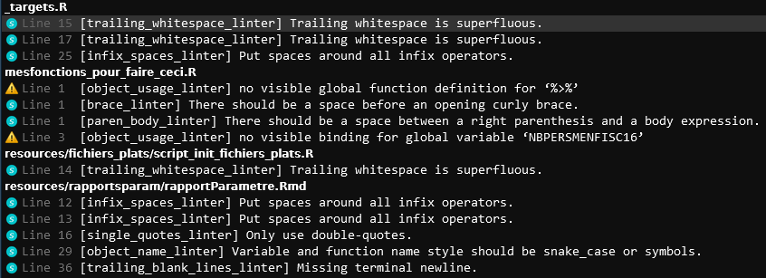

# Qualité du code {#code-quality}

::: {.callout-important}
## Tâche concernée et recommandation

L'utilisateur souhaite améliorer la qualité de ses scripts `R` pour favoriser leur lisibilité et leur maintenabilité.

- Il est recommandé d'utiliser le _package_ `lintr` pour obtenir des diagnostics de qualité du code.
- Il est recommandé d'utiliser le _package_ `styler` pour effectuer des reformatages automatiques d'un script.
- Dès qu'on utilise une même portion de code plus de deux fois, il convient de la transformer en fonction (principe du _don't repeat yourself_).
- Il est conseillé d'adopter la
notation `package::function` lorsqu'un _package_ n'est utilisé que pour un
nombre réduit de fonctions ou lorsque des fonctions issues de _packages_ différents portent le même nom. 
:::

Cette partie détaille de manière plus étendue les éléments enseignés
dans le cadre d'une formation aux bonnes pratiques 
construite par l'Insee et dont les supports ont été ouverts à 
[cette adresse](https://inseefrlab.github.io/formation-bonnes-pratiques-R/#/title-slide).


## Enjeux


Lors de l'apprentissage d'un langage, il est assez naturel de voir le code d’une manière très fonctionnelle : on désire réaliser une tâche donnée — par exemple nettoyer des champs textuels — et
on va donc assembler dans un script des bouts de code, souvent trouvés sur internet, jusqu’à obtenir un projet qui réalise la tâche voulue.
La structure du projet importe assez peu, tant qu’elle permet d’importer et traiter les données nécessaires à la tâche en question.

Si cette approche flexible et minimaliste fonctionne très bien lors de la phase d’apprentissage, il est malgré tout indispensable de s’en détacher progressivement à mesure qu’on progresse et que l’on peut être amené à réaliser des projets collaboratifs ou amenés à durer dans le temps.

Lorsqu'on travaille avec `R`, il est important de considérer
le code non seulement comme un outil pour effectuer des tâches,
mais aussi comme un __moyen de communiquer__
nos méthodes et résultats à d'autres personnes.
En adoptant des bonnes pratiques, on améliore la lisibilité
et la compréhension d'un code, ce qui facilite la collaboration avec
les réutilisateurs du code mais aussi auprès de publics extérieurs, comme les
chercheurs qui souhaitent comprendre les traitements mis en oeuvre.

La __lisibilité__ et la __maintenabilité__ du code
sont des aspects clés pour assurer la qualité d'un projet statistique.
Les bonnes pratiques aident à écrire du code clair et structuré, ce qui fait gagner du temps pour s'approprier un code (lisibilité), corriger des erreurs ou apporter des modifications à un code (maintenabilité).
Un code étant plus souvent lu qu'écrit[^1], c'est en effet la phase de maintenance d'un code qui s'avère la plus coûteuse, et non sa rédaction initiale.

[^1]: Cette phrase très connue est une citation de Guido Van Rossum, le créateur
de `Python`. `R` comme `Python` sont des langages conçus pour être plus
transparents et faciles à lire que des langages bas niveaux comme `C`. 

La __réutilisation__ d'un code ou de productions associées à du code,
comme des bases
de données, peut être grandement facilitée en adoptant des bonnes pratiques.


Grâce aux bonnes pratiques, nous pouvons nous assurer que notre
travail est __transparent__ et facilement __vérifiable__.
Cette exigence de __reproductibilité__, notion centrale dans le domaine de la recherche scientifique, s'applique également
dans d'autres domaines où la transparence méthodologique est cruciale pour la validité et la fiabilité des résultats. Un code de qualité facilite ainsi 
la vérification et la reproduction de nos résultats par d'autres personnes.
A l'image du processus de revue par les pairs (_peer review_)
dans le domaine scientifique,
se développent des revues de code (_code review_) qui favorisent la production
d'un code de qualité. 


## Adopter les standards communautaires

### Enjeux

> *"Good coding style is like correct punctuation: you can manage without it, butitsuremakesthingseasiertoread"*
>
> [Tidyverse Style Guide](https://style.tidyverse.org/)

Tout comme la correction de la ponctuation peut rendre un texte plus facile à lire,
une bonne pratique de codage peut rendre notre code plus facile à comprendre,
à maintenir et à réutiliser.

Il est notamment important de respecter les conventions du langage dans lequel le code est rédigé. Cela peut inclure des normes de formatage telles que l'indentation et la mise en forme, ainsi que des conventions de nommage telles que les noms de variables et de fonctions. En utilisant les conventions standardisées du langage, nous pouvons rendre notre code plus cohérent et plus facile à comprendre pour les autres personnes travaillant dans ce langage.

Il existe deux guides de référence qui exposent les conventions de la communauté
`R` concernant la qualité du code :
le [_`Tidyverse` style guide_](https://style.tidyverse.org/) et
le [_`Google` style guide_](https://google.github.io/styleguide/Rguide.html).
Ces guides proposent des conseils sur la façon d'écrire du code
clair et structuré en utilisant les bonnes pratiques recommandées pour le langage `R`.
Il est utile de lire les introductions et de se référer ponctuellement à ceux-ci
pour s'assurer d'adopter des bonnes pratiques en matière de codage en `R`.

::: {.callout-note}

Ces deux guides diffèrent sur certaines règles syntaxiques. 

Par exemple,
le  [_`Tidyverse` style guide_](https://style.tidyverse.org/functions.html#return) recommande de
ne pas introduire de `return` en fin de fonction alors que 
le [_`Google` style guide_](https://google.github.io/styleguide/Rguide.html#use-explicit-returns)
préconise de le faire. Les deux conventions peuvent se défendre 
et le choix entre les deux revêt une forme d'arbitraire. Par exemple, si on 
privilégie la lisibilité, il est conseillé d'inclure systématiquement un `return` dans les fonctions, alors
qu'un développeur cherchant la concision n'utilisera pas de `return`. De même,
le choix entre _camel case_ (objets dont les mots sont délimités avec des majuscules comme
`addValues`) dans le [_`Google` style guide_](https://google.github.io/styleguide/Rguide.html#naming-conventions)
et _snake case_ (séparation avec des `_` comme `add_values`) proposé par
 [_`Tidyverse` style guide_](https://style.tidyverse.org/syntax.html#object-names)
 est arbitraire. 
 
Comme il est difficile de donner des arguments objectifs pour privilégier une règle
 plutôt qu'une autre, il n'est pas impossible de parfois suivre celles du 
[_`Tidyverse` style guide_](https://style.tidyverse.org/) et
dans d'autres occasions celles du [_`Google` style guide_](https://google.github.io/styleguide/Rguide.html). 
L'important est plutôt d'être cohérent dans le cadre d'un projet en suivant les
mêmes conventions dans l'ensemble des scripts qui le constituent. 

:::


### Outils

Pour implémenter de manière automatisée certaines des règles syntaxiques
présentes dans les guides, il existe plusieurs types d'outils.

* Un [**_linter_**]{.orange} est un programme qui vérifie que le code est __formellement__ conforme à un certain _style guide_, et signale les erreurs. En revanche, un _linter_ ne modifie pas directement le code et ne repère pas les erreurs de fond.
* Un [**_formatter_**]{.orange} est un programme qui reformate un code source pour le rendre conforme à un certain _style guide_. Par définition, un _formatter_ modifie directement le code.

Un _linter_ se comporte un peu comme un correcteur orthographique d'un traitement de texte 
dont on aurait désactivé la fonction de remplacement automatique. Le
_formatter_ correspond plutôt au correcteur automatique d'un téléphone portable
qui corrige automatiquement ce qu'il considère comme des erreurs. 


::: {.callout-note}

- [Exemples d’erreurs repérées]{.blue2} par un _linter_ : 
    + lignes de code trop longues ou mal indentées, parenthèses non équilibrées, noms de fonctions mal construits…
- [Exemples d’erreurs __non__ repérées]{.blue2} par un _linter_ :
    + fonctions mal utilisées, arguments mal spécifiés, structure du code incohérente, code insuffisamment documenté…
:::

Dans le cas de `R` : 

- le [_linter_]{.orange} à utiliser est le _package_ [`lintr`](https://github.com/r-lib/lintr);
- le [_formatter_]{.orange} à utiliser est le _package_ [`styler`](https://github.com/r-lib/styler).

::: {.callout-tip}

Pour que `lintr` utilise le guide de style `tidyverse`, il suffit

```{r}
#| eval: false
lintr::use_lintr(type = "tidyverse")
```

:::

Pour utiliser un _linter_ sur l'ensemble des scripts d'un projet `R`,
la commande consacrée est :

```{r}
lintr::lint_dir()
```

Le _linter_ renvoie une suite, plus ou moins longue selon la qualité
du projet, de dérogations aux bonnes pratiques. 


Le _linter_ ne faisant pas les corrections automatiquement,
il est donc nécessaire d'ouvrir le fichier, se rendre à la ligne
correspondante, et corriger. Les lignes indiquées ne sont pas mises à 
jour automatiquement, elles peuvent donc ne plus correspondre à celles
du fichier lors de la phase de modifications. Il est donc pratique
de faire tourner régulièrement le _linter_ lors d'une phase de 
nettoyage. 

Il est également possible de n'évaluer qu'un fichier
avec `lintr::lint`:

```{r}
#| eval: false
lintr::lint("mesfonctions_pour_faire_ceci.R")
```

```{r}
#| echo: false
lintr::lint("../mesfonctions_pour_faire_ceci.R")
```

Le package `styler` propose le même type de fonctions qui vont quant à elles
modifier le code:

- Pour modifier un seul script, la fonction à utiliser est `styler::style_file` ;
- Pour modifier l'ensemble des scripts d'un dossier, la fonction à utiliser est `styler::style_dir`


## Utiliser des fonctions

### Pourquoi utiliser des fonctions?

L'utilisation de fonctions est l'une des bonnes pratiques en matière
de programmation qui s'applique à tous les langages de programmation,
y compris `R`.

La règle _DRY_ pour _do not repeat yourself_ (ne pas se répéter)
indique qu'il faut éviter de copier-coller du code lorsqu'il est utilisé plus de deux fois.
Au lieu de cela, on devrait encapsuler ce code dans une fonction et utiliser
cette fonction aux endroits où cela est nécessaire.

Utiliser des fonctions présente plusieurs avantages:


- Utiliser des fonctions réduit les risques d'erreurs liées au copier-coller de code. Si une modification est nécessaire, elle peut être apportée dans la fonction, __à un seul endroit du code__, ce qui garantit que toutes les utilisations de la fonction seront automatiquement mises à jour. Cette pratique minimise les erreurs et peut représenter une économie de temps substantielle dans un gros projet.

- Utiliser des fonctions rend également le code plus lisible et plus compact en encapsulant un traitement spécifique dans une section distincte du code.

- Utiliser des fonctions facilite la réutilisation et la documentation
du code. D'une part parce qu'en encapsulant un traitement dans une fonction, on peut facilement le réutiliser dans d'autres parties du code. D'autre part, parce que décrire clairement ce que fait chaque fonction contribue à documenter le code dans son ensemble.

Enfin, un nom bien choisi pour une fonction donne déjà une bonne idée de ce à quoi elle sert, facilitant en cela la compréhension d'une chaîne de traitements.

### Comment bien utiliser les fonctions?

Un biais à éviter est le [code spaghetti](https://fr.wikipedia.org/wiki/Programmation_spaghetti).
Il s'agit d'un code qui est difficile à comprendre et à maintenir en raison de sa complexité, de sa longueur et de sa structure désorganisée. 
Pour éviter le code spaghetti, il est important de suivre certaines règles pour écrire des fonctions pertinentes. Voici les trois principales règles à retenir :

* _Une tâche = une fonction_ : chaque fonction devrait effectuer une seule tâche spécifique. Cela permet de rendre le code plus clair et plus facile à comprendre.

* _Une tâche complexe = un enchaînement de fonctions réalisant chacune une tâche simple_ : si une tâche est complexe, elle peut être divisée en plusieurs tâches plus simples et encapsulées dans des fonctions distinctes. Cela permet de rendre le code plus facile à comprendre et à maintenir.

* _Limiter l'utilisation de variables globales_ : les variables globales sont accessibles depuis n'importe quel endroit du code, ce qui peut rendre le code difficile à comprendre et à maintenir. Il est donc recommandé de limiter l'utilisation de variables globales et d'utiliser des variables locales au lieu de cela. Cela permet de rendre le code plus clair et plus facile à comprendre.

## Auto-documenter son code

Les grands principes de la documentation de code consistent à :

* Documenter le pourquoi plutôt que le comment : il est plus important de comprendre pourquoi le code a été écrit de la manière dont il l'a été, plutôt que de connaître les détails techniques de son fonctionnement. En documentant le pourquoi, on peut mieux comprendre le but du code et comment il s'intègre dans le projet plus global.

* Privilégier l'auto-documentation via des nommages pertinents : le code peut être plus clair et plus facile à comprendre si les variables, les fonctions et les autres éléments ont des noms pertinents et explicites. Cela permet de documenter le code de manière implicite et de rendre la lecture du code plus intuitive.

En gardant ces grands principes à l'esprit, on peut écrire du code qui est plus facile à comprendre et à maintenir, ce qui peut économiser du temps et des ressources dans le long terme.

. . .

::: {.callout-tip}

Comment bien documenter un script ?

- [**Minimum**]{.orange} 🚦 : commentaire au début du script pour décrire ce qu'il fait ;
- [**Bien**]{.orange} 👍 : commenter les parties "délicates" du code ;
- [**Idéal**]{.orange} 💪 : documenter ses fonctions avec la syntaxe `roxygen2`.

:::


## Pas d'ambiguïté sur les _packages_ utilisés

Deux fonctions peuvent avoir le même nom dans des _packages_ différents. Par
exemple, la fonction `select` existe dans les _packages_ `dplyr` et `MASS`.
Par défaut, `R` utilise la fonction du _package_ chargé le plus récemment (avec `library()`). Ce comportement peut causer des erreurs difficiles à repérer,
car il est nécessaire d'exécuter le code pour les détecter. Par exemple, le code suivant renvoie une erreur difficile à comprendre si on ne l'a pas déjà rencontrée. 


```{r}
#| error: true
library(dplyr)
library(MASS)
bpe_ens_2018 <- duckdb::sql_query("
  INSTALL httpfs;
  LOAD httpfs;
  SELECT * FROM 'https://minio.lab.sspcloud.fr/projet-formation/diffusion/utilitR/doremifasoldata/bpe_ens_2018.parquet'
")

nombre <- bpe_ens_2018 %>%
  as_tibble() %>%
  select(TYPEQU, NB_EQUIP) 
```

Cela provient du fait que `MASS` étant le dernier _package_ chargé, `R`
utilise sa fonction `select` plutôt que celle de `dplyr`.

Afin d'éviter ces erreurs, il est recommandé de réserver
`library(pkg)` aux _packages_ dont on utilise des fonctions à de
nombreuses reprises dans un code. Inversement, pour les _packages_ utilisés de façon ponctuelle il est recommandé d'indiquer explicitement le _package_ en utilisant la notation `package::fonction()`.
De même, si une fonction présente le même nom dans deux packages, il est recommandé
d'utiliser cette notation. Cela permet de garantir que la bonne fonction est appelée et d'éviter les erreurs potentielles.


:::{.callout-conseil .icon}

## Le _package_ [`conflicted`](https://github.com/r-lib/conflicted#conflicted)

Le _package_ `conflicted` aide à gérer les conflits de _packages_ de manière fluide.
:::

## Ressources supplémentaires


- [_R Packages_](https://r-pkgs.org/man.html) par Hadley Wickham and Jenny Bryan
- Une [présentation très bien faite](https://mitmat.github.io/slides/2022-05-26-egu/code-data-open-science.html#1)
- [Un cours complet](https://eliocamp.github.io/reproducibility-with-r/) sur la reproductibilité avec `R`
- L'équivalent `Python` en [3A d'ENSAE](https://ensae-reproductibilite.github.io/website/)


## Exercices

to be completed
