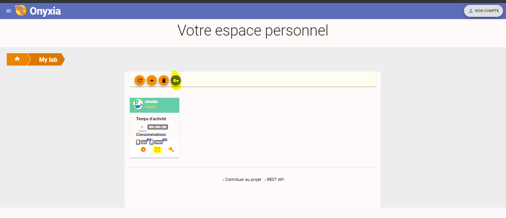
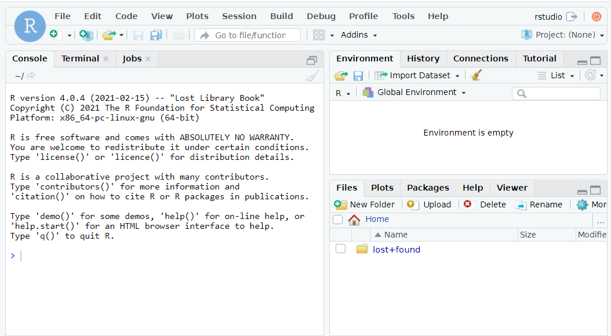

```{r setup, include=FALSE}
knitr::opts_chunk$set(echo = TRUE)
```

# <span style="color:steelBlue">**Travailler avec le SSP Cloud (WIP)**</span>

{width="1000"}

---

## 1. Création d'un compte **SSP Cloud**

- [Cliquer sur ce lien (https://datalab.sspcloud.fr/accueil)](https://datalab.sspcloud.fr/accueil)  
  - Suivre les indications. 
  
    - une adresse mail `@insee.fr`  
    - un identifiant ne contenant ni caractère spécial (- _ $ ...), ni accent.  

---

## 2. Création d'un service (**RStudio**)

- **Un environnement ergonomique et des services à la demande**
  - [Cliquer sur **"Consulter le catalogue"**](https://datalab.sspcloud.fr/my-lab/catalogue)  

{width="1000"}

---

<br>

- **Liste des catalogues disponibles**
  - Pour le moment, 1 seul dossier `datascience`. [Cliquer sur le petit dossier, en bas à drote](https://datalab.sspcloud.fr/my-lab/catalogue/inseefrlab-datascience)

{width="1000"}

---

<br>

Vous accédez alors à la liste des services. Cliquer sur l'image {width="40"} de `RStudio`
<br>

{width="1000"}

---

<br>

puis **Créer votre service**

{width="1000"}


---

<br>

Votre service `RStudio` est créé. Pour vous identifier (prochaine diapo), vous devez récupérer votre **`Password`**. Le plus simple est de cliquer sur la clé : vous copiez ainsi votre mot de passe.

{width="1000"}


---

<br>

Les identifiants sont :  

- `Username` : rstudio  
- `Password` : coller le MdP copié précédemment.

{width="1000"}


---

<br>

Vous voilà avec un beau `RStudio` comme celui que vous utilisez habituellement :)

{width="1000"}

---

## 3. Création du projet RStudio `formationShiny`

<br>

### 31. Nouveau projet

Dans le cadre de la formation R Shiny, on va créer un projet afin d'y enregistrer nos différent.e.s programmes et données.

{width="1000"}

---

<br>

{width="1000"}

---

<br>

{width="1000"}

---

<br>

{width="1000"}

---

<br>

Une première appli `RShiny` est créée à la racine de votre projet `formationShiny` : `app.r`. En dehors des exercies à réaliser, celle-ci sera bien pratique pour tester les différents morceaux de code que nous verrons pendant la formation.  

{width="1000"}

---

<br>

### 32. Création du dossier `donnees`

Tout d'abord, on crée un dossier qui se nomme `donnees` (minuscule sans accent)

- **`New folder ...`**
- Nommer ce dossier **`donnees`**  
  
{width="1000"}

---

<br>

### 33. Chargement des données :
  
- Cliquer sur ces liens et enregistrer les documents sur votre poste de travail,

  - [`poplegale_6815.sas7bdat`](https://minio.lab.sspcloud.fr/cedtas/formationShiny/poplegale_6815.sas7bdat),  
  - [`poplegale_6815.rds`](https://minio.lab.sspcloud.fr/cedtas/formationShiny/poplegale_6815.RDS),    
  - [`projections.xls`](https://minio.lab.sspcloud.fr/cedtas/formationShiny/projections.xls),  
  - [`messages.ods`](https://minio.lab.sspcloud.fr/cedtas/formationShiny/messages.ods).  
  
- Les charger dans votre projet `formationShiny`   

  - Cliquer sur **`upload`**  
  - Sélectionner un à un, chacun des fichiers ci-dessus que vous avez enregistrés sur votre poste de travail
 
---

<br>

{width="1000"}

---

<br>

### 34. Installation des packages nécessaires pour la formation :

- installer les packages qui seront nécessaires pendant la formation :
  - `billboarder`
  - `DT`
  - `ggformula` (un peu long à charger)
  - `rio` (un peu long à charger)
  - `shinydashboard`
  - `shinyFiles`
  
<span style="backgroung-color:steelBlue">Vous pouvez désormais travailler avec **RStudio** comme vous le feriez sur votre poste (ou sur AUS). Pensez à ajouter cette page dans vos favoris pour le retrouver facilement.</span>
    


