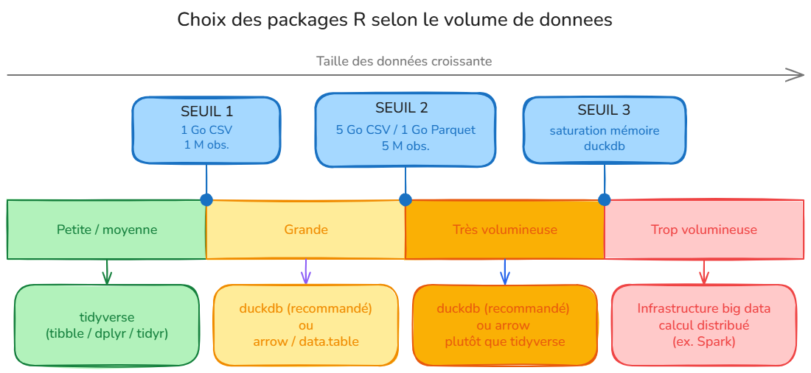

# Quel paradigme choisir pour la manipulation de données

L'utilisateur souhaite choisir un éco-système pour la manipulation de données dans `R`.

## Pourquoi choisir un paradigme pour manipuler des données ?

`R base`, `tidyverse`, `data.table`, `duckdb`, `arrow`... Il existe presque autant d'outils pour la manipulation de données que de statisticiens, ce qui peut être déroutant pour un utilisateur novice.

L'utilisation de `R base` (toutes les fonctions natives de `R`) bien que stable par définition, est vite limité dans la manipulation de tables : peu de cas d'utilisations possibles, code difficilement lisible sur des traitements complexes, fonctions non optimisées pour des données volumineuses... 

Au final, choisir son paradigme suit des règles très simples, axées notamment sur la volumétrie des données et le niveau des utilisateurs.

Le schéma suivant présente le paradigme à utiliser selon la taille des tables à manipuler :

Ce qu'il faut retenir :

* Pour des tables de données de **taille petite et moyenne** (**inférieure à 1 Go ou moins d'un million d'observations**), il est recommandé d'utiliser les *packages* `tibble`, `dplyr` et `tidyr` qui font l'objet d'une fiche [Manipuler des données avec le `tidyverse`](#tidyverse) ;

* Pour des tables de données de **grande taille** (**plus de 1 Go en CSV, plus de 200 Mo en Parquet, ou plus d'un million d'observations**), il est recommandé d'utiliser le *package* `duckdb` (voir la fiche [Manipuler des données avec `duckdb`](#duckdb)). L'utilisation des *packages* `data.table`, qui fait l'objet de la fiche [Manipuler des données avec `data.table`](#datatable), et `arrow`, qui fait l'objet de la fiche [Manipuler des données avec `arrow`](#arrow), n'est plus recommandée.

* Si les données sont **très volumineuses** (**plus de 5 Go en CSV, plus de 1 Go en Parquet ou plus de 5 millions d’observations**), il est recommandé de manipuler les données avec `duckdb` plutôt qu’avec le `tidyverse`. Il peut arriver que le volume de données soit tellement important qu’il ne soit pas possible de les traiter avec `duckdb`; il faut s’orienter vers des infrastructures big data permettant le calcul distribué et utiliser des logiciels adaptés (Spark par exemple).

::: {.callout-important}

Il est essentiel de travailler avec la dernière version d'`arrow`, de `duckdb` et de `R` car les packages `arrow` et `duckdb` sont en cours de développement. Par ailleurs, les recommandations d’utilitR peuvent évoluer en fonction du développement de ces packages.

:::