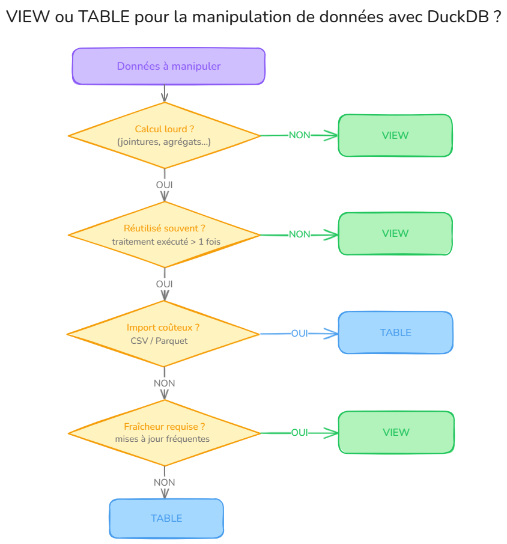

# Manipuler des données avec `duckdb` {#duckdb}

L'utilisateur souhaite manipuler des données structurées sous forme de `data.frame` par le biais de l'écosystème `duckdb` (sélectionner des variables, sélectionner des observations, créer des variables, joindre des tables).

## Pourquoi travailler avec le *package* `duckdb` pour un statisticien utilisant `R`?

Le *package* `duckdb` permet de faire trois choses:

-   Lire des sources de données dans une multitude de formats (csv, parquet, json, geojson, shape, postgresql...), y compris directement en ligne, y compris plusieurs fichiers d'un seul coup (en local comme avec S3, GCS ou HuggingFace);
-   Manipuler des données avec la syntaxe `dplyr`, ou avec le langage SQL;
-   Écrire des données dans une multitude de formats (csv, parquet, json, formats SIG...)

## Débuter avec `duckdb`

Apprendre à utiliser `duckdb` n'est pas difficile, car la syntaxe utilisée est quasiment identique à celle du `tidyverse`. Toutefois, une bonne compréhension du fonctionnement de `R` et de `duckdb` est nécessaire pour bien utiliser `duckdb` sur des données volumineuses. Voici quelques conseils pour bien démarrer:

-   Il est indispensable de lire la fiche [Manipuler des données avec le `tidyverse`](#tidyverse) avant de lire la présente fiche.
-   Il est recommandé de lire la fiche [Se connecter à une base de données](#bdd) avant de lire la présente fiche.
- Il est essentiel de travailler avec la dernière version de `duckdb` et de `R` car le *package* `duckdb` est en cours de développement. Par ailleurs, les recommandations d'`utilitR` peuvent évoluer en fonction du développement du _package_.
-   Il ne faut pas hésiter à demander de l'aide à des collègues, ou à poser des questions sur les salons Tchap adaptés (le salon Langage `R` par exemple).

::: {.callout-important collapse="true"}
## Pourquoi utiliser `duckdb` plûtot que `arrow` ? 

Bien que les *packages* `duckdb` et `arrow` aient des cas d'usage très similaires (voir la fiche [Manipuler des données avec `arrow`](#arrow)), l'utilisation de `duckdb` **est à privilégier** . En effet, `duckdb` est d'un usage plus général, plus fiable et plus rapide qu' `arrow`.
Le tableau ci-dessous compare quelques cas d'usage de ces deux *packages* :

| Je souhaite...                                                            | arrow | duckdb |
| ------------------------------------------------------------------------- | ----- | ------ |
| Optimiser mes traitements pour des données volumineuses                   | ✔️     | ✔️     |
| Travailler sur un fichier .parquet ou .csv sans le charger entièrement en mémoire | ✔️     | ✔️     |
| Utiliser la syntaxe `dplyr` pour traiter mes données                      | ✔️     | ✔️     |
| Utiliser du langage SQL pour traiter mes données                          | ❌     | ✔️     |
| Joindre des tables très volumineuses (plus de 4 Go)                          | ❌     | ✔️     |
| Utiliser des fonctions fenêtres (voir @sec-sql)                          | ❌     | ✔️     |
| Utiliser des fonctions statistiques qui n'existent pas dans arrow (voir @sec-sql) | ❌     | ✔️     |
| Écrire un fichier .parquet                                                | ✔️     | ✔️ *   |

\* pour écrire un fichier .parquet avec le package `duckdb`, il faut utiliser une instruction SQL (voir @sec-ecrire-parquet)
:::

## Présentation du projet `DuckDB` et du _package_ `R` associé

::: {.callout-note collapse="true"}
### Qu'est-ce que `duckdb`?  {#sec-presentation}

[`DuckDB`](https://duckdb.org/) est un projet *open-source* (license MIT) qui propose un moteur SQL optimisé pour réaliser des travaux d'analyse statistique sur des bases de données : 

- un moteur SQL rapide, capable d'utiliser des données au format `parquet` sans les charger complètement en mémoire,
- un dialecte SQL enrichi avec des fonctions qui facilitent l'analyse de données,
- une installation et une utilisation faciles,
- un moteur portable, utilisable sous Windows, MacOS, Linux, et interfacé avec de nombreux langages de programmation (R, Python, Javascript, etc.).

Un point important à comprendre est que **`DuckDB` n'est pas un outil spécifique à `R`**: `DuckDB` est un système de gestion de base de données (SGBD), similaire par exemple à une base `PostgreSQL`. Cela a deux conséquencées:

- la base de données `DuckDB` a une existence propre sur le disque ou dans la mémoire, et on peut donc lui envoyer directement des requêtes SQL, sans passer par `R`. 
- Il faut bien distinguer le projet `DuckDB` du *package* `R` `duckdb`. Ce *package* propose simplement une interface avec `R` parmi les autres interfaces existantes : Python, Java, Javascript, Julia, etc.

Toutefois, `DuckDB` est très facile à utiliser avec `R`, ce qui permet de bénéficier des optimisations inhérentes au langage SQL, à la fois en terme d'utilisation de la mémoire et de rapidité de calcul. C'est de plus un bon intermédiaire avant de passer à des infrastructures avancées telles que spark ou oracle.

:::

::: {.callout-tip collapse="true"}
## Quels sont les avantages de `duckdb`?

-   **Disponibilité immédiate** dans les cas "simples": DuckDB ne lit que les données strictement nécessaires à la requête (lazy scanning) et peut retourner les premières lignes d'un filtre ou d'une projection sans charger l'intégralité du fichier. Cette propriété ne s'applique pas aux opérations nécessitant de parcourir toutes les données : agrégations, tris, jointures;
-   **Performances élevées**: `duckdb` est très rapide pour la manipulation de données tabulaires (nettement plus performant que `dplyr` par exemple);
-   **Ne pas nécessairement charger les données en mémoire**: `duckdb` permet également de requêter directement sur des fichiers du disque dur (ou en ligne) sans avoir à charger tout le fichier en mémoire ;
-   **Optimisations automatiques**: avec des fichiers Parquet ou le format natif DuckDB, deux optimisations s'appliquent automatiquement : d'une part, seules les colonnes utiles à la requête sont lues et d'autre part, DuckDB exploite les statistiques stockées dans le fichier pour ignorer les blocs de lignes qui ne peuvent pas contenir les résultats recherchés, réduisant ainsi la quantité de données lues. Ces optimisations ne s'appliquent pas aux formats CSV ou JSON, pour lesquels DuckDB doit lire l'intégralité du fichier;
-   **Facilité d'apprentissage** grâce aux approches `dplyr` et SQL: `duckdb` peut être utilisé avec les verbes de `dplyr` (`select`, `mutate`, etc.) et/ou avec le langage SQL. Par conséquent, il n'est pas nécessaire d'apprendre une nouvelle syntaxe pour utiliser `duckdb`, on peut s'appuyer sur la ou les approches que l'on maîtrise déjà. 

:::

::: {.callout-warning collapse="true"}
## Quels sont les points d'attention à l'usage ?

-   __Préservation de l'ordre des lignes__ : contrairement à un moteur SQL classique, `duckdb` [préserve l'ordre des lignes pour certaines clauses](https://duckdb.org/docs/sql/dialect/order_preservation.html) mais le comportement diffère du {tidyverse} (par exemple`dplyr::*_join` conserve l'ordre mais pas l'ordre `JOIN` de `duckdb`)
-   __Traitement de données volumineuses__: `duckdb` peut traiter de gros volumes de données, qu'elles soient en mémoire vive ou sur le disque dur. Avec des données stockées sur le disque dur, `duckdb` est capable de faire les traitements sur des données plus volumineuses que la mémoire vive (RAM). C'est un avantage majeur en comparaison aux autres approches possibles en `R` (`data.table` et `dplyr` par exemple). Toutefois, il faut dans ce cas ajouter le temps de lecture des données au temps nécessaire pour le calcul.
-   __*Évaluation différée*__: `duckdb` construit des requêtes SQL, qui sont exécutées uniquement lorsque le résultat est explicitement demandée, après optimisation des étapes intermédiaires, et peuvent être exécutées partiellement. La @sec-lazy présente en détail cette notion.
-   __*Traduction en SQL*__: le package `dbplyr` traduit automatiquement les instructions `dplyr` en requêtes SQL compatibles avec `duckdb`, qui se charge ensuite de les exécuter. Il arrive toutefois que certaines fonctions `dplyr` n'aient pas d'équivalent direct dans le dialecte SQL de `duckdb` et ne puissent être traduites automatiquement par `dbplyr`. Dans ce cas, il faut parfois recourir directement à une expression SQL ou trouver une solution de contournement.. La @sec-sql donne quelques trucs et astuces dans ce cas.
-   __Interopérabilité__: `duckdb` est conçu pour être interopérable entre plusieurs langages de programmation tels que `R`, Python, Java, C++, etc. Cela signifie que les données peuvent être échangées entre ces langages sans avoir besoin de convertir les données, d'où des gains importants de temps et de performance.

:::

## Installation de `duckdb`

Il suffit d'installer le _package_ `duckdb`, qui contient à la fois `DuckDB` et une interface pour que `R` puisse s'y connecter.

```{r eval=FALSE}
install.packages("duckdb", repos="https://cloud.r-project.org")
```

## Utilisation de `duckdb`

Dans cette section, on présente l'utilisation basique de `duckdb`. C'est très facile: il n'est pas nécessaire de connaître le langage SQL car il est possible d'utiliser `duckdb` avec la syntaxe `dplyr`.

### Charger le *package* `duckdb`

Pour utiliser `duckdb`, il faut commencer par charger le *package*. Cela charge automatiquement le *package* `DBI`, qui permet de se connecter aux bases de données. Il est utile de charger également le *package* `dplyr` afin de pouvoir requêter la base de données avec la syntaxe bien connue de `dplyr`. 

```{r}
#| output: false
library(duckdb)
library(dplyr)
```

Le moteur `duckdb` fonctionnant "en dehors" de `R`, il détecte le nombre de processeurs et effectue les opérations en parallèle si possible. 

::: {.callout-important collapse="true"}
## Utilisation des packages `dplyr` / `dbplyr` / `duckplyr`

Trois packages coexistent pour manipuler des données avec la syntaxe `dplyr` :

- `dplyr` est le package de référence pour manipuler des `data.frame` et `tibble` en mémoire. 
- `dbplyr` est une extension qui permet d'utiliser la syntaxe `dplyr` avec n'importe quelle base de données SQL (dont DuckDB) : il traduit automatiquement le code `dplyr` en requêtes SQL, mais nécessite une connexion explicite et un `collect()` pour récupérer les résultats dans `R`. 
- [`duckplyr`](https://duckplyr.tidyverse.org/), présent dans le tidyverse, est une alternative plus récente : il se présente comme un remplacement direct de `dplyr` (même syntaxe, même comportement), en utilisant DuckDB comme moteur de calcul en arrière-plan. Contrairement à `dbplyr`, il n'y a pas de notion de connexion ni de `collect()`. `duckplyr` travaille directement sur des `tibble` et bascule automatiquement sur DuckDB quand c'est possible, avec un repli sur `dplyr` sinon.

Pour l'instant, il est recommandé de rester avec l'utilisation des packages `dplyr` et `dbplyr`.

:::

### Connexion à une base de données

`duckdb` est une base de données distante: il faut ouvrir une connexion, puis "charger" les données dans la base de données pour les manipuler. A la fin du traitement, il faut fermer la connexion.

#### Ouvrir une connexion

Pour commencer, on ouvre une connexion au moteur `duckdb` avec une base de données en mémoire vive de la façon suivante :

```{r}
conn_ddb <- DBI::dbConnect(drv = duckdb::duckdb())
```

Concrètement, cette commande crée une nouvelle base de données `duckdb` dans la mémoire vive. Cette base de données ne contient aucune donnée lorsqu'elle est créée. L'objet `conn_ddb` apparaît dans l'onglet `Data` de l'environnement `RStudio`, mais la liste des tables n'y est pas directement accessible. Pour plus d'informations, se reporter à la documentation du _package_ `DBI`.

#### Fermer une connexion
Lors de la fin du traitement (ou programme), on ferme la connexion avec le code ci-dessous :

```{r}
DBI::dbDisconnect(conn_ddb, shutdown = TRUE)
```

::: {.callout-important collapse="true"}
## Vérifier que la mémoire utilisée dans la session `duckdb` est bien libérée
L'option `shutdown` est importante : elle permet de fermer complètement la session `duckdb` et de libérer la mémoire utilisée. Si on n'utilise pas cette option, il arrive souvent que des connexions à moitié ouvertes continuent à consommer des ressources, et il faut alors relancer la session `R`.
:::

#### Paramétrer le nombre de cœurs utilisés dans une connexion

Par défaut, `duckdb` utilisera tous les cœurs disponibles. Si vous travaillez sur un serveur mutualisé, il est conseillé de limiter le nombre de cœurs utilisés par `duckdb` afin de ne pas consommer toutes les ressources. Vous pouvez trouver plus d'information dans la section [Configurer `duckdb`](#sec-configuration).

```{r}
conn_ddb <- DBI::dbConnect(duckdb::duckdb(
  config = list(threads = "6")
))

```

Pour la suite, on supposera que la connexion à une base de données duckdb est ouverte.

### Chargement des données

Maintenant que la connexion à une base de données duckDB est créée, chargeons des données dans cette base de données. Pour cela, deux méthods existent :

- En établissant un lien entre la base de données duckDB et les objets de la session `R`;
- En indiquant à `duckdb` l'emplacement des données sur le disque dur.

#### Chargement de données provenant de la session `R`

__La fonction `duckdb_register()` permet de charger dans `duckdb` des données présentes dans la session `R`.__ Cette méthode a l'avantage de ne pas _recopier_ les données: elle se contente d'établir un lien logique entre la base de données `duckdb` et un objet de la session `R`. 

*Voici un exemple avec la Base permanente des équipements: grâce à la fonction `duckdb::duckdb_register()`, l'objet `bpe_ens_2018` est référencé dans la base de données `duckdb` sous le nom `bpe_ens_2018_duckdb`.*

```{r}
# Charger la Base permanente des équipements 2018 dans la session R
bpe_ens_2018 <- duckdb::sql_query("
  INSTALL httpfs;
  LOAD httpfs;
  SELECT * FROM 'https://minio.lab.sspcloud.fr/projet-formation/diffusion/utilitR/doremifasoldata/bpe_ens_2018.parquet'
") |> as_tibble()

# Etablir le lien logique entre la base de données duckdb et la table de données
conn_ddb %>% duckdb::duckdb_register(
  name = "bpe_ens_2018_duckdb", 
  df = bpe_ens_2018)
```

::: {.callout-tip collapse="true"}
## Vérifier que le chargement des données a bien fonctionné
Le code ci-dessous permet de vérifier que le chargement des données a bien fonctionné. La fonction `tbl` permet d'accéder à un objet de la base de données par le nom (de la table), ou par du code SQL (utilisation un peu plus avancée). 

Par défaut, `duckdb` affiche les 10 premières lignes du résultat, sans effectuer tout le calcul. C'est très pratique et très rapide !

```{r}
conn_ddb %>% tbl("bpe_ens_2018_duckdb")
```

:::

#### Chargement de données stockées sur le disque dur

::: {.callout-note collapse="true"}
## Préambule : sauvegarder la table de travail sur le disque dur
Pour l'exemple suivant, on sauvegarde les données `bpe_ens_2018` au format Parquet.

```{r}
dir.create("bpe_ens_2018_dataset", showWarnings = FALSE)
duckdb::duckdb_register(conn_ddb, "bpe_ens_2018", bpe_ens_2018)
DBI::dbExecute(conn_ddb, "COPY bpe_ens_2018 TO 'bpe_ens_2018_dataset/bpe_ens_2018.parquet' (FORMAT PARQUET)")
```
:::

**Pour manipuler des données stockées en Parquet avec `duckdb` sans avoir à les charger en mémoire, il faut utiliser la fonction `dplyr::tbl()` qui lit directement les fichiers Parquet avec `duckdb`:** 

```{r messages=FALSE}
bpe_ens_2018_dataset <- conn_ddb %>% tbl("read_parquet('bpe_ens_2018_dataset/**/*.parquet')")
```

Quelques explications de cette commande:

* La fonction [`read_parquet`](https://duckdb.org/docs/data/parquet/overview.html#read_parquet-function) est une fonction interne à `duckdb`. `duckdb` propose aussi [des fonctions pour lire d'autres formats](https://duckdb.org/docs/data/csv/overview.html) comme csv, json...
* `**/*.parquet` est un motif qui indique que vous souhaitez lire, dans tous les sous-dossiers quelque soit le niveau (`**`), l'ensemble des fichiers parquets (`*.parquet`) qui s'y trouvent. C'est notamment utile pour lire des fichiers Parquet partitionnés. 

::: {.callout-tip collapse="true"}
## Astuce : import de fichiers parquet
Quand vous n'avez pas besoin de passer d'arguments à `read_parquet`, vous pouvez l'omettre :

```{r messages=FALSE}
conn_ddb %>% tbl('bpe_ens_2018_dataset/**/*.parquet')
```
:::

 __Cette approche établit une connexion aux données contenues dans le dataset Parquet, mais elle ne charge pas les données en mémoire__ (ni dans la mémoire de `R`, ni dans celle de `DuckDB`). 

#### Chargement de données provenant du stockage S3 (LS3 / SSPCloud)

De plus en plus de statisticiens utilisent la plateforme de datascience Onyxia, dont le [SSPCloud](https://datalab.sspcloud.fr/home) (instance ouverte aux agents publiques sur [datalab.sspcloud.fr/](https://datalab.sspcloud.fr/home)) et LS3 (plateforme interne à l'Insee) en sont des instances.
Le chargement des données sur la base `duckdb` peut être plus complexe à réaliser, notamment car un lien doit être fait entre la base de données et le service s3.

Pour cela, une table `secret` doit être créée dans la base de données avec tous les credentials nécessaires à la connexion au service S3, afin que `duckdb` puisse établir cette connexion :

```{r, eval = FALSE}

DBI::dbExecute(con, sprintf("
  CREATE SECRET my_s3_secret (
    TYPE S3,
    KEY_ID '%s',
    SECRET '%s',
    ENDPOINT '%s',
    SESSION_TOKEN '%s',
    REGION 'us-east-1',
    URL_STYLE 'path'
  )",
  Sys.getenv("AWS_ACCESS_KEY_ID"),
  Sys.getenv("AWS_SECRET_ACCESS_KEY"),
  Sys.getenv("AWS_S3_ENDPOINT"),
  Sys.getenv("AWS_SESSION_TOKEN")
))

```
Toutes ces variables sont déjà définies dans le service Rstudio / VScode ouvert, il n'y a donc pas besoin de les redéfinir.

Une fois cette table de secret créée, il suffit de lancer la requête SQL avec `dbExecute()`, en ajoutant le chemin vers les données stockées dans le S3 :

```{r, eval=FALSE}
bpe_ens_2018_s3 <- DBI::dbGetQuery(con, glue::glue(
        " SELECT *
          FROM read_parquet('https://minio.lab.sspcloud.fr/projet-formation/diffusion/utilitR/doremifasoldata/bpe_ens_2018.parquet')
        ")
    )
```

### Manipulation des données avec la syntaxe `dplyr`

Le _package_ `R` `duckdb` a été écrit de façon à pouvoir manipuler les données avec la syntaxe de `dplyr` (`select`, `filter`, `mutate`, `left_join`, etc.). `duckdb` traduit le code `R`, y compris certaines fonctions de `stringr` et `lubridate` en requête SQL. Cela s'avère très commode en pratique, car lorsqu'on sait utiliser `dplyr` et le `tidyverse`, on peut commencer à utiliser `duckdb` sans avoir à apprendre une nouvelle syntaxe de manipulation de données. 


*Dans l'exemple suivant, on calcule le nombre d'équipements par région, à partir d'un `tibble` et à partir d'une table `duckdb`:*

:::: {.columns}

::: {.column width="49%"}

__Manipulation d'un `tibble`__

```{r message=FALSE}
duckdb::sql_query("
  INSTALL httpfs;
  LOAD httpfs;
  SELECT * FROM 'https://minio.lab.sspcloud.fr/projet-formation/diffusion/utilitR/doremifasoldata/bpe_ens_2018.parquet'
") |>
  group_by(REG) |>
  summarise(
    NB_EQUIP_TOT = sum(NB_EQUIP)
  )
```

:::

::: {.column width="2%"}
<!-- empty column to create gap -->
:::

::: {.column width="49%"}

__Manipulation d'une table `duckdb`__

```{r}
bpe_ens_2018_dataset |>
  group_by(REG) |>
  summarise(
    NB_EQUIP_TOT = sum(NB_EQUIP)
  ) |>
  collect()
```

:::

::::

La seule différence apparente entre les deux traitement est la présence de la fonction `collect()` à la fin des instructions.

::: {.callout-note collapse="true"}
## La fonction `collect()`
Cette fonction indique que l'on souhaite obtenir le résultat du traitement sous la forme d'un `tibble` : *ie.* qu'on passe d'une table `duckdb` à un objet disponible dans l'environnement `R`. Les résultats sont identiques, à l'exception de l'ordre des lignes. En effet, un moteur SQL ne respecte pas l'ordre par défaut, il faut le demander explicitement avec `arrange`.

:::

::: {.callout-note collapse="true"}
## Comment `duckdb` exécute une requête `dplyr`
On peut examiner la requête SQL construite par `duckdb` avec la fonction `show_query()`.

```{r}
bpe_ens_2018_dataset |>
  group_by(REG) |>
  summarise(
    NB_EQUIP_TOT = sum(NB_EQUIP)
  ) |>
  show_query()
```

Cette requête est envoyée au serveur SQL et exécutée de façon différente en fonction de la dernière instruction du traitement:

- si le traitement se termine par `collect()`: le calcul est exécuté en entier et le résultat est retourné sous la forme d'un `tibble`,
- si le traitement se termine par `print(n=nb_lignes)` : `dplyr` ajoute automatiquement un LIMIT à la requête SQL. **Dans le cas où il n'y a pas d'opérations bloquantes (agrégations, tris...), `duckdb` peut exploiter ce LIMIT pour ne lire qu'une partie des données et retourner rapidement les premières lignes. En présence d'opérations bloquantes, toutes les données sont néanmoins traitées.** *Il ne faut pas hésiter à s'en servir pour explorer les données et pour construire le traitement étape par étape, en ajustant en fonction des résultats.*

:::

### Manipulation des données avec SQL

`DuckDB` étant un moteur SQL à part entière, on peut interagir avec `DuckDB` directement avec des requêtes SQL. 

Avec DuckDB, on peut matérialiser un résultat à l'aide de requêtes SQL de deux façons :

- **Une table** : les données sont calculées et stockées physiquement (en mémoire ou sur disque). C'est utile si le calcul est long et que vous souhaitez réutiliser le résultat plusieurs fois sans le recalculer.
- **Une vue (view)** : Une vue sauvegarde une requête SQL sous un nom, sans en stocker le résultat, contrairement à une table. La requête est réexécutée à chaque appel, ce qui permet de nommer et réutiliser une requête complexe sans consommer de mémoire supplémentaire. En revanche, elle peut limiter les optimisations que DuckDB applique automatiquement, ce qui, sur de grandes bases de données ou en cas d'appels fréquents, peut dégrader les performances. Il convient donc de trouver un équilibre entre lisibilité et performance.

En pratique, préférez toujours une vue si vous n'avez pas besoin de conserver le résultat durablement. Ce schéma résume l'utilisation de `TABLE` ou `VIEW` selon le contexte du traitement :



Pour créer une table ou une vue, on utilise `DBI::dbExecute()` qui envoie une instruction SQL à DuckDB :
  
```{r}
# Créer une table dans la base de données DuckDB 
DBI::dbExecute(conn_ddb, "
               CREATE TABLE bpe_ens_2018_table AS 
               SELECT REG, SUM(NB_EQUIP) AS NB_EQUIP_TOT 
               FROM bpe_ens_2018_duckdb 
               GROUP BY REG") # Utilise de la mémoire

# Créer une vue dans la base de données DuckDB
DBI::dbExecute(conn_ddb, "
               CREATE VIEW bpe_ens_2018_view AS 
               SELECT REG, SUM(NB_EQUIP) AS NB_EQUIP_TOT 
               FROM bpe_ens_2018_duckdb 
               GROUP BY REG")   # n'utilise pas de mémoire

# Lire le résultat dans R sous forme de tibble
nb_equip_bpe <- DBI::dbGetQuery(conn_ddb, "SELECT * FROM bpe_ens_2018_view")
```

::: {.callout-note}
`DBI::dbExecute()` est utilisé pour les instructions qui modifient la base (créer une table, une vue, insérer des lignes...) : il retourne le nombre de lignes affectées. 

`DBI::dbGetQuery()` est utilisé pour les instructions qui retournent des données (SELECT) : il retourne un tibble.
:::

Vous pouvez ensuite requêter les objets créés dans la base SQL via `dplyr`:

```{r}
conn_ddb %>% tbl("bpe_ens_2018_view")
```

Vous pouvez bien sûr lire des fichiers `Parquet`, `CSV` ou autres en utilisant les [fonctions de duckdb](https://duckdb.org/docs/data/overview) :

```{r}
DBI::dbGetQuery(conn_ddb, "SELECT * FROM read_parquet('bpe_ens_2018_dataset/**/*.parquet') LIMIT 5")
```

::: {.callout-tip}
Le SQL de `duckdb` est très proche de celui de PostgreSQL avec [quelques évolutions très pertinentes](https://duckdb.org/docs/guides/sql_features/friendly_sql).
:::


#### Séparer vos traitements SQL en blocs

Si vos requêtes deviennent trop complexes et/ou longues, vous pouvez facilement les découper en créant des vues intermédiaires que vous réutiliserez plus tard :

```{r eval=FALSE}
# Créer une vue qui correspond à la première étape du traitement
dbExecute(conn_ddb, "CREATE OR REPLACE VIEW data1_nettoye AS SELECT ... FROM read_parquet('data1.parquet')")

# Créer une vue qui correspond à la deuxième étape du traitement
dbExecute(conn_ddb, "CREATE OR REPLACE VIEW data2_nettoye AS SELECT ... FROM read_parquet('data2.parquet')")

# Faire la dernière étape du traitement et récupérer les résultats dans un tibble
resultats <- dbGetQuery(conn_ddb, "SELECT * FROM data1_nettoye LEFT JOIN data2_nettoye ON data1.id = data2.id")
```

Et vous pouvez bien sûr créer des tables intermédiaires (temporaires ou non) à la place des vues (en utilisant `CREATE TABLE` pluôt que `CREATE VIEW`) pour éviter de les recalculer à chaque fois.

::: {.callout-note collapse="true"}
## Regrouper plusiuers requêtes SQL dans une seule

Vous pouvez grouper les requêtes SQL dans un même `dbExecute` :

```{r eval=FALSE}
# Créer une vue qui correspond à la première étape du traitement
dbExecute(conn_ddb, 
  "CREATE OR REPLACE VIEW data1_nettoye AS SELECT ... FROM read_parquet('data1.parquet');
   CREATE OR REPLACE VIEW data2_nettoye AS SELECT ... FROM read_parquet('data2.parquet');
   SELECT * FROM data1_nettoye LEFT JOIN data2_nettoye ON data1.id = data2.id")"
)
```

Ou utiliser la clause SQL `WITH` :

```{r eval=FALSE}
# Créer une vue qui correspond à la première étape du traitement
dbExecute(conn_ddb, 
  "WITH data1_nettoye AS (SELECT ... FROM read_parquet('data1.parquet')),
        data2_nettoye AS (SELECT ... FROM read_parquet('data2.parquet'))
   SELECT * FROM data1_nettoye LEFT JOIN data2_nettoye ON data1.id = data2.id")"
)
```

### Écriture au format Parquet {#sec-ecrire-parquet}

Pour écrire une table (ou le résultat de n'importe quelle requête) sur le disque au format Parquet avec `duckdb`, il faut utiliser l'instruction SQL `COPY ... TO ... (FORMAT PARQUET)`

*Par exemple, nous exportons un data.frame présent dans l'environnement `R` dans un fichier parquet*:

```{r}
dir.create("temp_dataset", showWarnings = FALSE) # Création d'un répertoire pour l'export du fichier parquet

duckdb::duckdb_register(conn_ddb, "bpe_ens_2018_temp", bpe_ens_2018) # ajouter l'objet R dans la base duckDB
DBI::dbExecute(conn_ddb, "COPY bpe_ens_2018_temp TO 'temp_dataset/bpe_ens_2018.parquet' (FORMAT PARQUET)")

list.files("temp_dataset") # Lecture des fichiers présents dans le répertoire "temp_dataset"
```

Attention, l'instruction SQL `COPY ... TO ... (FORMAT PARQUET)` permet d'exporter des tables `duckdb` uniquement. Pour exporter une table depuis l'environnement `R`, il faut établir un lien entre la base `duckdb` et la table présente dans la session `R` grâce à la foncton `duckdb_register()`.

Vous pouvez aussi utiliser les fonctions d'export du _package_ `duckplyr` :

```{r, eval=FALSE}
req <- duckplyr::as_duckdb_tibble(source_data) |>
    # opérations dplyr ...
  duckplyr::compute_parquet("mon_dataset.parquet")
```

::: {.callout-warning}
`compute_parquet()` écrit un fichier Parquet unique et ne supporte pas le partitionnement. Si vous avez besoin d'un dataset partitionné, utilisez la commande SQL `COPY ... TO ... (FORMAT PARQUET, PARTITION_BY (...))`.
:::

::: {.callout-caution collapse="true"}
## Utilisation du package `arrow` pour l'export de fichier parquet
Même si le package `arrow` peut sembler plus simple à utiliser que SQL pour certaines manipulations `dplyr`, il est préférable de rester avec `duckdb` pour limiter les dépendances et garder une approche cohérente. 
:::

### Exemple minimal d'utilisation de duckdb dans un projet

```{r, eval=FALSE}
library(duckdb)
library(dplyr)

con <- DBI::dbConnect(drv = duckdb::duckdb())

# Chargement des données

## 1 - Directement dans la session R, puis dans la base duckdb
bpe_ens_2018 <- duckdb::sql_query("
  INSTALL httpfs;
  LOAD httpfs;
  SELECT * FROM 'https://minio.lab.sspcloud.fr/projet-formation/diffusion/utilitR/doremifasoldata/bpe_ens_2018.parquet'
") |> as_tibble()

con %>% duckdb::duckdb_register(
  name = "bpe_ens_2018_duckdb", 
  df = bpe_ens_2018)

# Cette ligne permet l'export de la table afin de tester la deuxième méthode d'import
DBI::dbExecute(con, "COPY bpe_ens_2018_duckdb TO 'bpe_ens_2018.parquet' (FORMAT PARQUET)")

## 2 - Depuis un fichier stocké sur le disque dur (ou dans un service)
bpe_ens_2018_dataset <- con %>% tbl("read_parquet('bpe_ens_2018.parquet')")

## 3 - Depuis un fichier stocké sur le S3 
# création de la table des secrets
DBI::dbExecute(con, sprintf("
  CREATE SECRET my_s3_secret (
    TYPE S3,
    KEY_ID '%s',
    SECRET '%s',
    ENDPOINT '%s',
    SESSION_TOKEN '%s',
    REGION 'us-east-1',
    URL_STYLE 'path'
  )",
  Sys.getenv("AWS_ACCESS_KEY_ID"),
  Sys.getenv("AWS_SECRET_ACCESS_KEY"),
  Sys.getenv("AWS_S3_ENDPOINT"),
  Sys.getenv("AWS_SESSION_TOKEN")
))

bpe_ens_2018_s3 <- DBI::dbGetQuery(con, glue::glue(
        " INSTALL httpfs;
          LOAD httpfs;
          SELECT *
          FROM read_parquet('https://minio.lab.sspcloud.fr/projet-formation/diffusion/utilitR/doremifasoldata/bpe_ens_2018.parquet')
        ")
    )

# Manipulation de données (table duckdb)

## 1 - avec SQL

### a - Créer une View
DBI::dbExecute(con, "
  CREATE VIEW bpe_ens_2018_view AS 
  SELECT REG, SUM(NB_EQUIP) AS NB_EQUIP_TOT 
  FROM bpe_ens_2018_duckdb 
  GROUP BY REG")

### b - Créer une table duckdb
DBI::dbExecute(con, "
  CREATE TABLE bpe_ens_2018_table AS 
  SELECT REG, SUM(NB_EQUIP) AS NB_EQUIP_TOT 
  FROM bpe_ens_2018_duckdb 
  GROUP BY REG") # Utilise de la mémoire

## 2 - avec dplyr
bpe_ens_2018_dataset |>
  group_by(REG) |>
  summarise(
    NB_EQUIP_TOT = sum(NB_EQUIP)
  ) |>
  collect() # permet de passer une table duckdb en tibble sur la session R

# Export dans un fichier parquet
dir.create("temp_dataset", showWarnings = FALSE) # Création d'un répertoire pour l'export du fichier parquet

duckdb::duckdb_register(con, "bpe_ens_2018_temp", bpe_ens_2018) # ajouter l'objet R dans la base duckDB
DBI::dbExecute(con, "COPY bpe_ens_2018_temp TO 'temp_dataset/bpe_ens_2018.parquet' (FORMAT PARQUET)")


DBI::dbDisconnect(con, shutdown = TRUE)

```

## Bien utiliser `duckdb` avec l'évaluation différée {#sec-lazy}

### Principe : construire la requête avant de l'exécuter

Quand on écrit du code `dplyr` avec `duckdb`, les instructions ne sont **pas exécutées immédiatement** : `dbplyr` les traduit en SQL et attend. On dit que les objets créés sont des **requêtes différées** : ils décrivent ce qu'il faut faire, sans le faire encore.

```{r}
# Ces deux étapes ne déclenchent aucun calcul
req_etape1 <- bpe_ens_2018_dataset |>
  group_by(DEP) |>
  summarise(NB_EQUIP_TOT = sum(NB_EQUIP))

req_etape2 <- req_etape1 |>
  filter(DEP == "59")
```

::: {.callout-tip}
Si vous ne savez plus si un objet est une requête différée ou un `tibble` contenant des données, exécutez `class(votre_objet)` : une requête différée a la classe `tbl_dbi`, un tibble a la classe `tbl_df`.
:::

### Visualiser la requête SQL avec `show_query()`

À tout moment, on peut inspecter la requête SQL construite par `dbplyr` avec `show_query()` :

```{r}
req_etape1 |> show_query()
req_etape2 |> show_query()
```

On constate que la deuxième requête **contient** la première : `duckdb` a assemblé toutes les instructions en une seule requête SQL. On remarque également que `duckdb` a **réordonné** les opérations : le filtre sur le département 59 est appliqué _avant_ l'agrégation, afin de réduire la quantité de données à traiter. C'est l'optimiseur de `duckdb` qui fait ce travail automatiquement.

### Déclencher l'exécution avec `collect()`

L'exécution n'a lieu qu'au moment où on appelle `collect()`, qui envoie la requête SQL à `duckdb` et retourne le résultat sous forme de `tibble` dans R :

```{r}
req_etape2 |> collect()
```

Tant que l'instruction `collect()` n'est pas exécutée, aucun calcul n'a lieu : les instructions `dplyr` s'accumulent silencieusement pour former une requête. Au moment de l'exécution de `collect()`, `dbplyr` traduit l'ensemble de ces instructions en une seule requête SQL, puis la transmet à `duckdb` qui l'exécute. `duckdb` renvoie le résultat à R sous forme de `tibble`. Tout ce qu'on écrit **après** `collect()` est ensuite exécuté par R sur ce `tibble`. 
Il faut donc passer **le maximum d'opérations avant** `collect()`, pour que `duckdb` les exécute de façon optimisée plutôt que R.

::: {.callout-tip collapse="true"}
## Astuce : sauvegarder sans `collect()`

Il est possible de sauvegarder le résultat directement sur disque sans jamais charger les données dans R, en utilisant `COPY` à la place de `collect()`. `dbplyr::remote_query()` récupère la requête SQL sans déclencher son exécution :

```{r}
DBI::dbExecute(conn_ddb, paste0(
  "COPY (", dbplyr::remote_query(req_etape2), ") TO 'resultats.parquet' (FORMAT PARQUET)"
))
```
:::

### Limites de l'évaluation différée

L'évaluation différée est très efficace, mais elle a ses limites. Pour des traitements complexes (nombreuses jointures, agrégations multiples), la requête SQL générée peut devenir très volumineuse et nécessiter beaucoup de mémoire pour être exécutée en une seule fois.
Lorsque `duckdb` manque de mémoire, il retourne une erreur explicite — voir @sec-configuration pour les options de configuration mémoire.

Une autre limite concerne la **lisibilité et le débogage** : une requête correspondant à 200 lignes de code `dplyr` est difficile à inspecter et à corriger en cas d'erreur.

### Décomposer le traitement avec `compute()`

La solution consiste à découper le traitement en étapes, en matérialisant les résultats intermédiaires avec `compute()`. Contrairement à `collect()`, `compute()` crée une **table temporaire dans `duckdb`** : les données restent dans `duckdb`, elles ne sont pas chargées dans R.

```{r eval=FALSE}
# Étape 1 : retraitement de la première table — résultat stocké dans duckdb
table_intermediaire1 <- bpe_ens_2018_dataset |>
  select(...) |>
  filter(...) |>
  mutate(...) |>
  compute()

# Étape 2 : retraitement de la deuxième table
table_intermediaire2 <- autre_dataset |>
  select(...) |>
  filter(...) |>
  compute()

# Étape 3 : jointure et résultat final dans R
resultat <- table_intermediaire1 |>
  left_join(table_intermediaire2, by = "identifiant") |>
  collect()
```

::: {.callout-tip}
## Quelques conseils pour bien séquencer les étapes

1 - **Cohérence logique** : les étapes doivent avoir un sens. Si le traitement consiste à retraiter deux tables puis à les joindre, trois étapes s'imposent naturellement.
2 - **Longueur raisonnable** : une étape de 30 à 40 lignes est un bon point de départ ; au-delà, la requête risque d'être trop complexe.
3 - **Jointures volumineuses** : éviter d'enchaîner plus de deux ou trois jointures sur de grandes tables sans `compute()` intermédiaire.
4 - **Construire progressivement** : vérifier le résultat de chaque étape avec `print()` avant d'ajouter la suivante.
:::

## Notions avancées

### Configurer `duckdb` {#sec-configuration}

`duckdb` propose de nombreux paramètres mais nous n'allons voir que les principaux. Vous pouvez vous reporter à la [documentation officielle](https://duckdb.org/docs/configuration/overview) pour en apprendre davantage sur la configuration de `duckdb`.

::: {.callout-note collapse="true"}
#### Configuration lors de l'initialisation de la base de données

Pour configurer `duckdb` au moment de la connexion, on passe les options dans le _driver_ avant d'appeler `DBI::dbConnect()` :

```{r}
#| eval: false
drv <- duckdb::duckdb(
  dbdir = "fichier.db",
  config = list(
    threads = "4",
    memory_limit = "40GB",
    temp_directory = "tmp_path/",
    preserve_insertion_order = "true"
  )
)
conn_ddb <- DBI::dbConnect(drv = drv)
```
  
| Paramètre | Rôle | Conseil |
|-----------|------|---------|
| `dbdir` | Par défaut, `duckdb` stocke tout en mémoire vive et efface tout à la fermeture de la session. En spécifiant un chemin, la base
est sauvegardée sur disque et réutilisable. | Utile surtout si vous créez des tables ou des vues avec SQL ou `dplyr::compute()`. Pour un
usage `dplyr` classique, la mémoire suffit. |
| `threads` | Nombre de processeurs utilisés. Par défaut, `duckdb` utilise tous les processeurs disponibles. | Sur un serveur partagé,
limitez à 4 ou 8 _threads_. Prévoir 5 à 10 Go de mémoire par _thread_ (5 pour des agrégations, 10 pour des jointures). Au-delà de 8
_threads_, le gain de performance est souvent marginal. |
| `memory_limit` | Quantité maximale de mémoire vive que `duckdb` peut utiliser (80 % de la mémoire disponible par défaut). | Si la mémoire
est limitée, préférez réduire le nombre de _threads_ plutôt que de baisser cette limite. |
| `temp_directory` | Dossier dans lequel `duckdb` écrit des fichiers temporaires quand la mémoire est pleine (_spill to disk_). | Utile en
dernier recours si vous manquez légèrement de mémoire. Réduire les _threads_ reste plus efficace. Ce paramètre est fixé automatiquement si
vous utilisez une base persistante. |
| `preserve_insertion_order` | Indique si `duckdb` doit conserver l'ordre de lecture/écriture des données. Conserver cet ordre consomme de la
mémoire. | Mettre à `"false"` si l'ordre n'a pas d'importance (pas de `arrange()` / `ORDER BY`), pour réduire la consommation mémoire. |
  
:::

::: {.callout-note collapse="true"}
#### Fixer les paramètres après l'initialisation

Vous pouvez également changer les paramètres d'une base après son initialisation en utilisant la commande `dbExecute`. Par exemple, pour fixer le nombre de _threads_ à 4 :

```{r}
#| eval: false
dbExecute(conn_ddb, "SET threads = '4';")
```
:::

### Fonctions non traduites et/ou comment passer des paramètres ? {#sec-sql}

Il arrive que `dbplyr` ne sache pas traduire une fonction `R` en SQL DuckDB. Dans ce cas, **la fonction inconnue est reprise telle quelle dans le code SQL**, ce qui provoque une erreur à l'exécution :

```{r}
bpe_ens_2018_dataset |>
  mutate(test = fonction_inexistante(DEP)) |>
  show_query()
```

La solution est simple : **utiliser directement la fonction DuckDB équivalente** dans le code `R`. DuckDB dispose d'un grand nombre de fonctions optimisées ([documentation](https://duckdb.org/docs/sql/functions/overview)) qui peuvent être appelées directement depuis `R`.


**Exemple** 

Supposons des dates au format "JJ/MM/AAAA" :

```{r}
dates <- tibble(
  date_naissance = c("02/07/1980", "29/02/2004"),
  date_deces     = c("05/06/2001", "12/07/2023")
)
conn_ddb |> duckdb::duckdb_register(name = "dates_duckdb", df = dates, overwrite = TRUE)
```

La fonction `R` `as.Date()` ne fonctionne pas ici : `dplyr` ne sait pas traduire l'argument `format`, et DuckDB n'accepte que le format "AAAA-MM-JJ" par défaut.

```{r error=TRUE}
conn_ddb |> tbl("dates_duckdb") |>
  mutate(date_naissance = as.Date(date_naissance, format = "%d/%m/%Y"))
```

Il suffit d'utiliser la fonction DuckDB `strptime()` directement dans le code `R` :

```{r}
conn_ddb |> tbl("dates_duckdb") |>
  mutate(date_naissance = strptime(date_naissance, "%d/%m/%Y"))
```

::: {.callout-tip collapse="true"}
## Appliquer une même fonction sur plusieurs colonnes

Cette approche fonctionne aussi avec `mutate(across())` pour appliquer la fonction à plusieurs colonnes à la fois :

```{r}    
liste_variables <- c("date_naissance", "date_deces")
conn_ddb |> tbl("dates_duckdb") |>
  mutate(across(all_of(liste_variables), ~ strptime(., "%d/%m/%Y")))
```
:::

::: {.callout-warning collapse="true"}
## Comportement de `duckplyr` et `dbplyr` en cas de fonction inconnue

`duckplyr` et `dbplyr` ne se comportent pas de la même façon lorsqu'une fonction n'est pas disponible dans DuckDB :

- avec **`duckplyr`** : le traitement bascule silencieusement sur `dplyr` standard, ce qui implique de **charger les données en mémoire**. Sur des données volumineuses, cela peut saturer la RAM sans avertissement explicite. Activez `options(duckplyr.fallback_info = TRUE)` pour être notifié des bascules.

- avec **`dbplyr`** : la fonction inconnue est **transmise telle quelle à DuckDB** sous forme de SQL. Cela permet d'utiliser directement des fonctions natives DuckDB (comme `strptime()`), mais génère une erreur SQL si la fonction n'existe pas non plus côté DuckDB.
:::

### Optimisations

Les opérations difficiles en SQL, longues, nécessitant beaucoup de mémoire, sont les fonctions dites "fenêtre": jointures, `GROUP BY` avec beaucoup de petits groupes, dédoublonnage, etc. On propose ici quelques techniques pour faire passer ces calculs difficiles.

::: {.callout-note collapse="true"}
#### Utilisation de la mémoire vive

Par défaut, les objets manipulés avec `duckdb` sont de simples requêtes SQL : les données restent sur le disque et ne sont chargées en mémoire que le temps du calcul, avant d'être libérées. La mémoire utilisée correspond donc au résultat du calcul, pas aux données en entrée.

Toutefois, certaines opérations complexes (jointures volumineuses, agrégations sur de très grands fichiers) nécessitent de conserver temporairement beaucoup de données en mémoire. Lorsque la mémoire est saturée, `duckdb` renvoie une erreur de ce type :

```
Error: rapi_execute: Failed to run query
Error: Out of Memory Error: could not allocate block of size 262KB (99.7MB/100.0MB used)
Database is launched in in-memory mode and no temporary directory is specified.
Unused blocks cannot be offloaded to disk.

Launch the database with a persistent storage back-end
Or set PRAGMA temp_directory='/path/to/tmp.tmp'
```

**Solutions, de la plus simple à la plus avancée :**  

**1. Réduire le nombre de _threads_** (recommandé en premier). Moins de _threads_ = moins de calculs en parallèle = moins de mémoire consommée. La règle est de prévoir 5 à 10 Go de mémoire par _thread_ :

```{r eval=FALSE}
conn_ddb <- dbConnect(duckdb(),
config=list("threads"="1")))
```
ou

```{r eval=FALSE}
dbExecute(conn_ddb, "SET threads = '1';")
```

 **2. Écrire les résultats au fur et à mesure.** La commande SQL `COPY ... TO` sait écrire en Parquet de façon incrémentale pour certains calculs, sans tout charger en mémoire :

```{r eval=FALSE}
DBI::dbExecute(conn_ddb, "COPY (SELECT ...) TO 'resultats.parquet' (FORMAT PARQUET)")
```

**3. Découper le calcul** en étapes intermédiaires sauvegardées sur disque, pour ne traiter qu'une partie des données à la fois.

**4. Utiliser une base persistante sur disque.** En adossant `duckdb` à un fichier sur disque, il peut y écrire des fichiers temporaires quand la mémoire est pleine (_spill to disk_). Cette option ralentit les calculs et ne résout pas tous les cas :

```{r eval=FALSE}
conn_ddb <- DBI::dbConnect(duckdb::duckdb(), dbdir = "my-db.duckdb")
```

::: {.callout-tip}
L'interaction entre ces différentes options est complexe et les effets varient selon les données et les calculs. En pratique, **commencer par réduire le nombre de _threads_** est le levier le plus simple et le plus efficace.
:::
:::

::: {.callout-note collapse="true"}
#### Sauvegarder des résultats intermédiaires

Dans plusieurs cas, vous pouvez vouloir passer par des résultats intermédiaires :

- Votre traitement est long et vous ne souhaitez pas le recalculer entièrement à chaque fois ;
- Certaines requêtes sont trop compliquées pour le moteur SQL et/ou pour la traduction automatique, vous devez le découper.

Vous pouvez utiliser `dbplyr::compute()` pour créer une table `duckdb` stockée sur le disque (si vous avez préalablement créé une base sur disque) que vous pourrez directement utiliser par la suite dans une autre session :

```{r eval=FALSE}
conn_ddb %>%
  calcul1() %>%
  compute(name = "matable", temporary = FALSE)

tbl(conn_dbb, "matable") %>%
  calcul2()
```

A noter que vous pouvez également utiliser `dbplyr::compute` pour créer une table temporaire `duckdb` stockée en mémoire qui disparaitra à la fin de votre session :

```{r eval=FALSE}
table_temporaire <- conn_ddb %>%
  calcul1() %>%
  compute()

table_temporaire %>%
  calcul2()
```
:::

::: {.callout-note collapse="true"}
#### Partitionner les données lors de l'export de fichier

**Qu'est-ce que le partitionnement ?**

Partitionner consiste à découper un fichier de données en plusieurs sous-fichiers selon les valeurs d'une colonne. Par exemple, partitionner par région crée un fichier par région. DuckDB peut alors lire uniquement le fichier de la région qui l'intéresse, sans parcourir toutes les données.  

**Pourquoi le partitionnement accélère les calculs : la notion d'index**

Pour exécuter efficacement certaines opérations (filtres, fonctions fenêtre comme `rank()` ou `lag()`), DuckDB a besoin d'un _index_ : un mécanisme qui lui indique rapidement où se trouvent les données qui l'intéressent, sans tout lire.
  
Les fichiers Parquet disposent d'un index _min-max_ : chaque bloc de données indique dans ses métadonnées les valeurs minimale et maximale qu'il contient. DuckDB peut ainsi sauter les blocs qui ne correspondent pas à un filtre.

Le partitionnement va plus loin : en organisant physiquement les données par valeur d'une colonne, il permet à DuckDB de lire uniquement le(s) sous-fichier(s) pertinents, sans même parcourir les autres.

Créer un index SQL classique est une alternative, mais elle nécessite de charger les données en mémoire, ce qui est incompatible avec de très gros volumes.

**Comment partitionner avec DuckDB ?**

```{r}
dir.create("bpe_ens_2018_dataset_parts", showWarnings = FALSE)

unlink("bpe_ens_2018_dataset_parts", recursive = TRUE) # supprime les anciens fichier avant l'écriture
DBI::dbExecute(conn_ddb, "COPY bpe_ens_2018 TO 'bpe_ens_2018_dataset_parts' (FORMAT PARQUET, PARTITION_BY (REG))")

list.files("bpe_ens_2018_dataset_parts") # un sous-répertoire par région
```

DuckDB crée automatiquement un sous-répertoire par valeur de `REG`, chacun contenant un fichier Parquet avec les données de cette région.

:::

::: {.callout-note collapse="true"}
#### Exécuter _explicitement_ les traitements par groupe

Dans le cas où les données doivent absolument être chargées en mémoire, le calcul peut être découpé pour ne charger qu'une partie des données. Par exemple, faire une jointure région par région au lieu de faire la jointure sur toute la base d'un coup. On peut utiliser le partitionnement pour sauvegarder les résultats partiels, et les ré-assembler ensuite.

```{r eval=FALSE}
groups <- bpe_ens_2018_dataset %>% 
  distinct(REG) %>%
  pull() # liste des modalités de la variable REG

# Définir une fonction qui traite un morceau des données
# Puis exporte le résultats dans un Parquet partitionné
f <- function(x) {
  bpe_ens_2018_dataset %>% 
    filter(REG == x) %>% 
    calcul_long() 

  DBI::dbExecute(conn_ddb, paste0(
    "COPY (", dbplyr::remote_query(req),
    ") TO 'resultat' (FORMAT PARQUET, PARTITION_BY (REG))"
  ))
}

# Appliquer la fonction à chaque groupe
purrr::walk(f, groups)
```

:::

## Pour en savoir plus {#Ressourcesduckdb}

- la documentation officielle du _moteur_ [`DuckDB`](https://duckdb.org/docs/) (en anglais) ;
- la documentation du _package_ R [DuckDB](https://r.duckdb.org/) ;
- la documentation du _package_ [`DBI`](https://dbi.r-dbi.org/) décrit les mécanismes de traduction `dplyr` vers SQL utilisés dans toutes les bases de données interfacées avec `R`.
- la documentation officielle du _package_ [duckplyr](https://duckplyr.tidyverse.org/)

```{r}
#| echo: false
DBI::dbDisconnect(conn_ddb, shutdown = TRUE)
```


