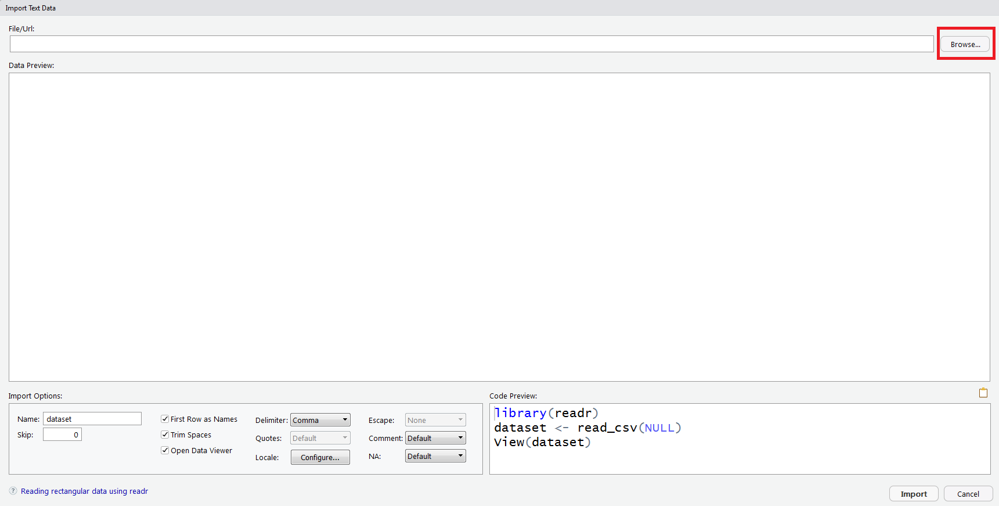
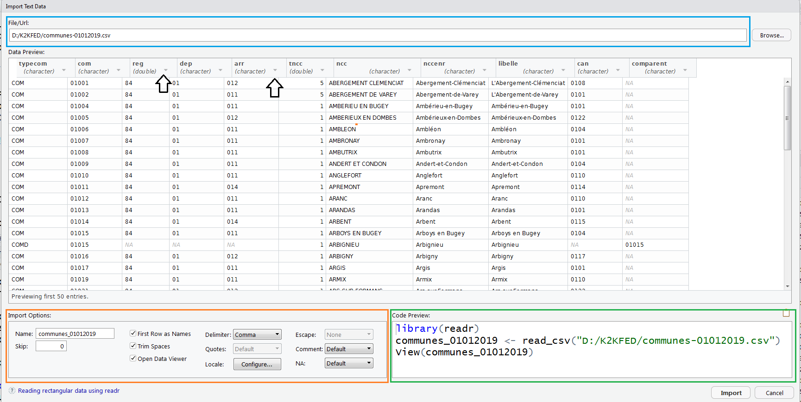

# Importer des fichiers plats (`.csv`, `.tsv`, `.txt`)

## Tâches concernées et recommandations

L'utilisateur souhaite importer dans `R` des données stockées sous forme de fichiers plats (formats `.txt`, `.csv`, `.tsv`).

::: recommandation
**Recommandations de l'Insee**

* Pour importer des données de taille réduite (jusqu'à 1 Go), **il est recommandé d'utiliser les fonctions `read_csv()` et `read_delim()` du *package* `readr`**;
* Pour importer des données de taille plus importante (supérieure à 1 Go), **il est recommandé d'utiliser la fonction `fread()` du *package* `data.table`**.
* **L'usage du *package* `csvread` est déconseillé**, de même que l'utilisation des fonctions natives de `R` `read.csv()` et `read.delim()`.
:::

## Importer des fichiers plats de taille limitée:  le *package* `readr`

Le *package* `readr` propose plusieurs fonctions adaptées pour importer des fichiers plats de taille limitée (moins de 1 Go):

* `read_csv()` : lecture d'un csv délimité par des virgules, avec un point comme marqueur décimal;
* `read_csv2()` : lecture d'un csv séparé par des points-virgules, avec une virgule comme marqueur décimal;
* `read_delim()` : fonction plus générale et paramétrable, pour lire des fichiers délimités.

Il faut charger le *package* `readr` pour utiliser ces fonctions:

```{r} 
library(readr)
```

::: conseil
**Conseil**
Si vous êtes débutants en `R`, il est recommandé d'utiliser l'utilitaire d'importation de `Rstudio`. Une fois que les données sont correctement importées, vous pourrez copier-coller le code dans votre script `R` et vous familiariser avec les fonctions du *package* `readr`.
:::

::: remarque
**Remarque**

**Il est nettement plus simple de sélectionner des colonnes avec `fread()` qu'avec les fonctions du *package* `readr`**. Il est donc recommandé d'utiliser `fread()` lorsque vous souhaitez sélectionner facilement les colonnes à importer.
:::

### Utiliser l'assistant d'importation `Rstudio`

Pour les utilisateurs débutants, `Rstudio` propose une interface graphique très commode pour importer des fichiers plats avec `readr`. On y accède avec: `File > Import Dataset > From text (readr)...`. On obtient la fenêtre suivante. En cliquant sur `Browse` (rectangle rouge), on peut définir le chemin du fichier que l'on souhaite importer.

{width=100%} 

Une fois que le fichier à importer a été sélectionné, un aperçu des premières lignes du fichier s'affiche dans la fenêtre. Dans l'exemple ci-dessous, on essaie d'importer le fichier des communes du Code Officiel Géographique (version 2019). La fenêtre comprend deux panneaux très utiles:

* Un panneau qui permet de définir les **options d'importation** (rectangle orange);
* Un panneau qui donne le **code qui réalise l'importation demandée** (rectangle vert).

{width=100%} 

Les principales options d'importation comprennent notamment:

* `Name`: Le nom du `data.frame` dans lequel les donnée seront stockées;
* `First Row as Names`: à cocher si la première ligne contient les noms de colonnes;
* `Delimiter`: Indique le délimiteur des données. Pour mémoire: `Comma` = virgule, `Semicolon` = point virgule, `Tab` = tabulation, `Whitespace` = espace, `Other...` = autre (à définir);
* `Locale...`: définit les options locales d'importation, notamment l'encodage et le marqueur décimal qui sont des sources récurrentes de problèmes;
* `NA`: indique la valeur retenue lorsqu'une valeur est manquante.

Enfin, il est possible de modifier le type des données en cliquant sur la petite flèches à côté de l'en-tête de colonne (flèches noires).

### Utiliser `read_csv()` et `read_csv2()`


Les fonctions `read_csv()` et `read_csv2()` sont des fonctions d'importation spécialement conçues pour les fichiers `.csv`. Ces deux fonctions sont identiques, sauf sur deux points:

* la fonction `read_csv()`  suppose par défaut que le séparateur est une virgule, et que le marqueur décimal est un point. 
* La fonction `read_csv2()` suppose par défaut que le séparateur est un point-virgule, et que le marqueur décimal est une virgule.

Voici les principales options de `read_csv()` et de `read_csv2()`:

| Argument  | Valeur par défaut | Fonction                                                       |
|-----------|-------------------|----------------------------------------------------------------|
| `file`      | Aucune            | Le chemin du fichier à importer                                |
| `col_names` | `TRUE`              | La première ligne contient-elle les noms de colonne?           |
| `col_types` | `NULL`              | Définir le type des variables                                  |
| `cols_only` | Toutes les variables  | Sélecionner les variables (voir ci-dessous)                                  |
| `skip`      | `0`                 | Sauter les n premières lignes (0 par défaut)                   |
| `n_max`     | `Inf`               | Nombre maximum de lignes à importer (pas de limite par défaut) |
| `locale`    |                   | Réglages locaux (encodage, marqueur décimal...)                |

Quelques remarques sur les options de `read_csv()`:

* `read_csv()` essaie par défaut de deviner le type des colonnes (*integer* pour les nombres entiers, *character* pour les chaînes de caractères...). L'option `col_types` permet de choisir le type des colonnes, et doit être égale à un vecteur dont chaque élément est de la forme `nom_variable = [type de colonne]`. Les types de colonnes disponibles sont `col_integer()`, `col_logical()`, `col_double()`, `col_character()` (voir `?cols` pour la liste complète).
Exemple: si on importe une variable comme nombre entier et une variable comme caractère, on écrit: `col_types = c(var1 = col_integer(), var2 = col_character())`.
* `read_csv()` importe par défaut toutes les colonnes du fichier. Il est possible de sélectionner les colonnes qu'on veut importer avec certaines options, mais l'usage de `read_csv()` devient vraiment complexe. Si vous avez besoin de sélectionner des colonnes, **il est fortement recommandé d'utiliser `fread()`** plutôt que `read_csv` (voir plus bas).

**Exemple**: on veut importer le fichier des communes du code officiel géographique (version 2019, [disponible ici](https://www.insee.fr/fr/information/3720946)), en déclarant que le fichier est encodé en UTF-8 et en imposant que le code commune soit lu comme une chaîne de caractères et le code région comme un nombre entier. On écrit le code suivant: 

```{r, eval = FALSE}
library(readr)
communes <- read_csv("D:/K2KFED/communes-01012019.csv", 
                     locale = locale(encoding ="UTF-8"),
                     col_types = c(com = col_character(),
                                   reg = col_integer())
                     )
names(communes)
```

### Utiliser la fonction `read_delim()`

La fonction `read_delim()` est faite pour lire toutes sortes de fichiers plats, et propose de nombreuses options pour l'adapter au fichier considéré. Elle est puissante, mais plus difficile à utiliser que les fonctions `read_csv()` et `read_csv2()`, qui sont des versions simplifiées de `read_delim()`. En pratique, ces deux fonctions sont le plus souvent suffisantes, et il est rare d'avoir vraiment besoin d'utiliser `read_delim()`.

La fonction `read_delim()` propose les mêmes options que `read_csv()` et `read_csv2()`, avec deux ajouts principaux:

* `delim`: le délimiteur du fichier plat;
* `escape_backslash` (`TRUE`/`FALSE`): les caractères spéciaux du fichier plat ont-ils un échappement (`\`)?

Pour en savoir plus sur `read_delim()`, il suffit de consulter l'aide avec `?read_delim`.


## Importer des fichiers plats de grande taille: la fonction `fread()` du *package* `data.table`

Le *package* `data.table` permet d'importer des fichiers plats avec la fonction `fread()`. Cette fonction présente trois avantages:

* Elle est très rapide pour importer de gros volumes de données (et nettement plus rapide que les fonctions du *package* `readr`);
* Elle permet de sélectionner facilement les colonnes qu'on veut importer (option `select`);
* Elle propose un grand nombre d'options, adaptées pour les usages avancés.

Pour utiliser `fread()`, il faut charger le *package* `data.table`:

```{r, eval = FALSE}
library(data.table)
```


Les principales options de `fread()` sont les suivantes:

| Argument         | Valeur par défaut                           | Fonction                                                              |
|------------------|---------------------------------------------|-----------------------------------------------------------------------|
| `file`             | Aucune                                      | Le chemin du fichier à importer                                       |
| `sep`              | Le caractère le plus fréquent parmi `,\t |;:` | Le délimiteur du fichier                                              |
| `header`           | `fread()` essaie de deviner                 | La première ligne contient-elle les noms de colonnes?                 |
| `nrows`            | `Inf`                                         | Nombre maximum de lignes à importer (pas de limite par défaut)        |
| `skip`             | `0`                                           | Sauter les n premières lignes (0 par défaut)                          |
| `stringsAsFactors` | `FALSE`                                       | Les chaînes de caractères sont-elles traitées comme des facteurs?     |
| `select`           | `NULL`                                        | Sélectionner les colonnes à importer                                  |
| `drop`             | `NULL`                                        | Sélectionner les colonnes à ne pas importer                           |
| `colClasses`       | `fread()` essaie de deviner                 | Définir le type des variables                                         |
| `encoding`         | `"unknown"`                                   | Définir l'encodage du fichier (`"UTF-8"` ou `"Latin-1"`)                  |
| `dec`              | Le point                                      | Définir le marqueur décimal                                        |
| `data.table`       | `TRUE`                                        | `fread` renvoie un `data.table` si `TRUE`, un `data.frame` si `FALSE` |
| `showProgress`     | `TRUE`                                        | Indiquer la progression de l'importation                              |

Quelques remarques sur les options de `fread()`:

* `fread()` importe par défaut toutes les colonnes

    - L'option `select` permet de sélectionner les colonnes, et doit être égale à un vecteur de noms. Exemple: `select = c("var1", "var2", "var4")`;
    - Inversement, l'option `drop` permet de préciser quelles colonnes ne seront pas importées. Les options `select` et `drop` ne peuvent pas être utilisées en même temps.

* `fread()` essaie par défaut de deviner le type des colonnes (*integer* pour les nombres entiers, *character* pour les chaînes de caractères...). L'option `colClasses` permet de choisir le type des colonnes, et doit égale à un vecteur dont chaque élément est de la forme `nom_variable = "type"`. Exemple: `colClasses = c(var1 = "character", var2 = "logical", var4 = "double")`;
* l'option `stringsAsFactors = TRUE` peut ralentir sensiblement l'importation des données; il faut l'utiliser avec circonspection.

Exemple 1: on veut à nouveau importer le fichier des communes du code officiel géographique, en déclarant que le fichier est encodé en UTF-8 et en imposant que le code commune soit lu comme une chaîne de caractères et le code région comme un nombre entier. On écrit le code suivant:

```{r, eval = FALSE}
communes <- fread("D:/K2KFED/communes-01012019.csv",
                  colClasses = c(com = "character",
                                 reg = "integer"),
                  encoding = "UTF-8")
```

Exemple 2: on veut réaliser la même importation que précédemment, mais en sélectionnant uniquement le code commune, le nom de la commune et la région. On écrit le code suivant:

```{r, eval = FALSE}
communes <- fread("D:/K2KFED/communes-01012019.csv",
                  select = c("com", "libelle", "reg"),
                  colClasses = c(com = "character",
                                 reg = "integer"),
                  encoding = "UTF-8")
```

## Quelques bonnes pratiques

Voici quelques bonnes pratiques à avoir en tête pour importer des données:

* **Vérifier que votre machine peut charger les données**: `R` importe les données dans la mémoire vive de la machine. Si les fichiers que vous voulez importer sont d'une taille supérieure à celle de la mémoire vive, vous ne pourrez pas les importer intégralement.
* **Tester votre code d'importation avec quelques lignes**: il faut souvent tâtonner pour bien importer des données. Il est donc recommandé de commencer par importer quelques centaines ou quelques milliers de lignes (en utilisant l'option `n_max` des fonctions du *package* `readr` ou `nrows` de `fread()`) pour vérifier que le code est correct.
* Il est important d'**importer un nombre réduit de colonnes**. Bien sélectionner les colonnes permet souvent de réduire significativement la taille des données et de résoudre le problème mentionné au point précédent. Toutefois, seule la fonction `fread()` de `data.table` permet de sélectionner facilement les colonnes (option `select`).
* **Vous pouvez choisir le *package* que vous utilisez en fonction des outils que vous voulez utiliser pour manipuler les données**: les fonctions de `readr` renvoient un objet `tibble` tandis que `fread()` renvoie un objet `data.table`. Si vous prévoyez d'utiliser des *packages* du *tidyverse* (notamment `tidyr` et `dplyr`), il est préférable d'utiliser `readr`. Si vous prévoyez d'utiliser `data.table`, il est préférable d'utiliser `fread()`.

## Ressources

* Sur `readr`:

    - la [documentation du *package*](https://www.rdocumentation.org/packages/readr) (en anglais);
    - une [introduction à `readr`](https://cran.r-project.org/web/packages/readr/vignettes/readr.html) (en anglais);
    - l'[aide-mémoire du *package*](https://rawgit.com/rstudio/cheatsheets/master/data-import.pdf) (en anglais);
    
* sur `data.table`:
    - la [documentation du *package*](https://www.rdocumentation.org/packages/data.table) (en anglais).


