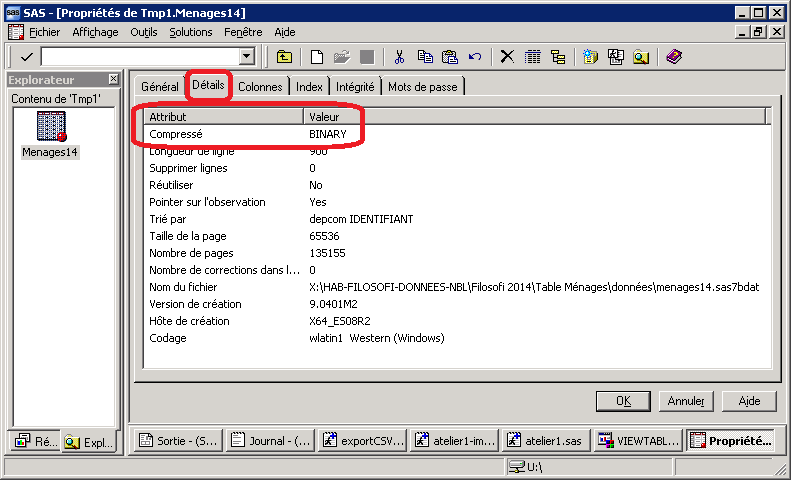

# Importer des données depuis SAS vers `R`

## Tâches concernées et recommandations

L'utilisateur souhaite importer dans `R` des données stockées sous format SAS.

::: recommandation
**Recommandations de l'Insee**

* **Pour des données de taille petite ou moyenne (moins de 1 Go), l'usage de la fonction `read_sas()` du package `haven` est recommandé.**
* **Pour des fichiers de taille importante (plus de 1 Go), il est  recommandé de procéder en deux temps**:
    * Exporter les données SAS en format `.csv`;
    * Importer en R les données `.csv`.

**Il est déconseillé d'utiliser les packages suivants pour importer des données SAS : `sas7dbat`, `foreign`, `Hmisc`, `SASxport`.**

:::


## Quelques détails sur les packages recommandés

## Comment utiliser `haven`?
La fonction du package `haven` à utiliser se nomme `read_sas()`

```r
library(haven)

# chargement d'une table RP depuis le lecteur GEN - environ 20"
dfRP <- read_sas("mon/chemin/de/dossier/tableSAS.sas7bdat")
```

Options de `read_sas()`

* Sélectionner les colonnes parmi celles présentes dans la base SAS

```r=
dfRP <- read_sas("W:/A1090/GEN_A1090990_DINDISAS/RPADUDIF.sas7bdat", cols_only = c("NUMERO", "ANAIX", "DPNAIX"))
```

* Obtenir la liste des labels de colonne de la table importée avec `haven`

```r=
library(sjlabelled)
get_label(dfRP)

```

* encoding - Cet argument est à renseigner uniquement si l'importation des caractères accentués se passe mal. La valeur à indiquer dépend de la source.

```r=
dfRP <- read_sas("W:/A1090/GEN_A1090990_DINDISAS/RPADUDIF.sas7bdat", encoding = "UTF-8")
```

## Comment procéder en deux temps?

Export depuis SAS: exemple de code

```sas=
options mprint mlogic notes;

libname donnees "W:/A1090/GEN_A1090990_DINDISAS/"; 

PROC EXPORT DATA= donnees.RPADUDIF
            OUTFILE= "U:/RP.csv" 
            DBMS=CSV REPLACE;
     PUTNAMES=YES;
RUN;
```

Renvoyer à la fiche import de fichiers plats.


## Pour aller plus loin

## Quelques conseils

* N'importer que les colonnes nécessaires.
* Les tables SAS compressées en BINARY ne sont pas prises en charge par le package `haven`. Il faut donc procéder en deux étapes (export en CSV puis import dans R)

{width=100%} 


## Références

* doc de haven

```r=
library(haven)
?read_sas
```

