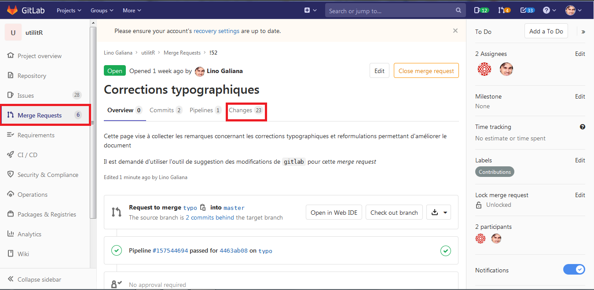
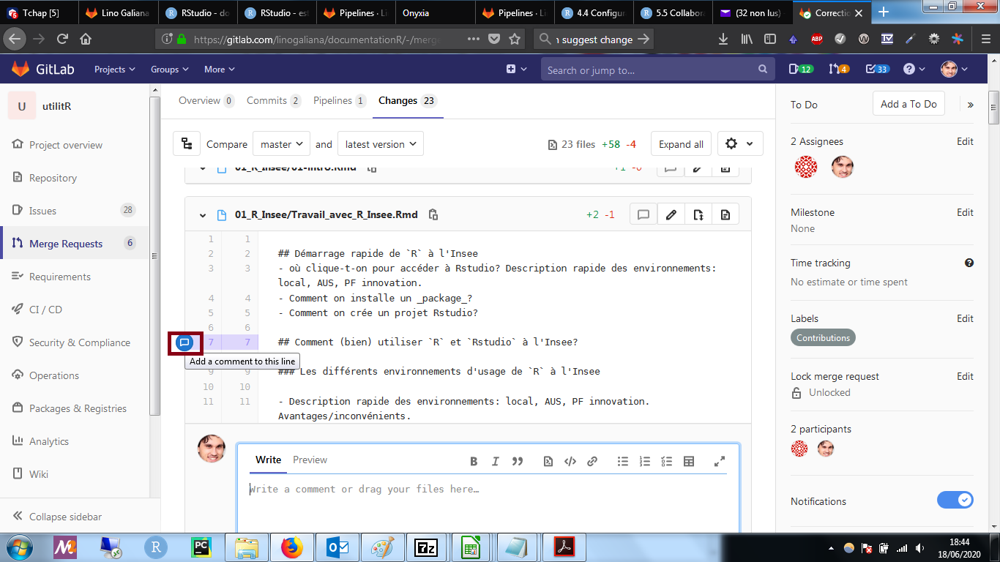
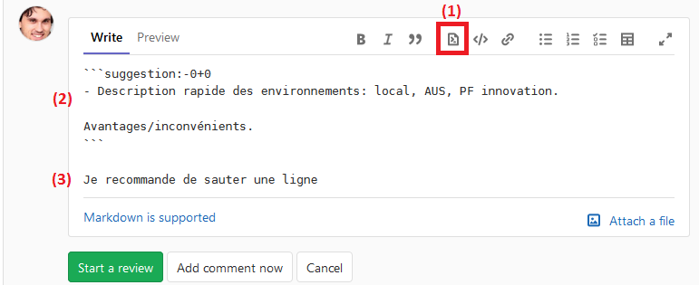
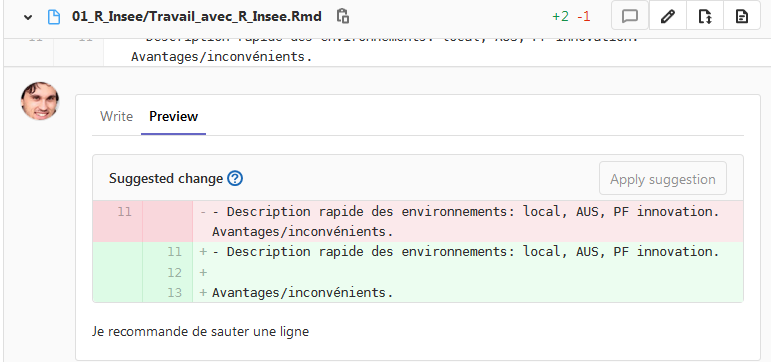
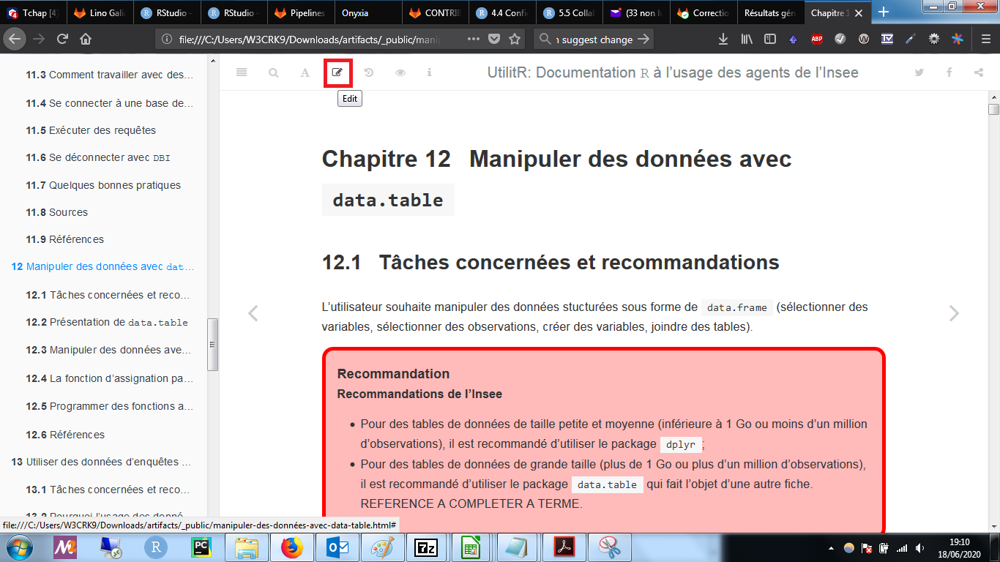
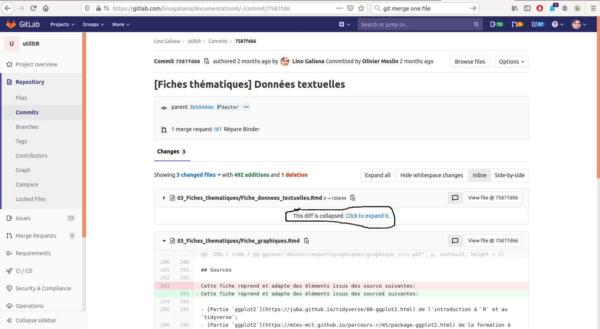
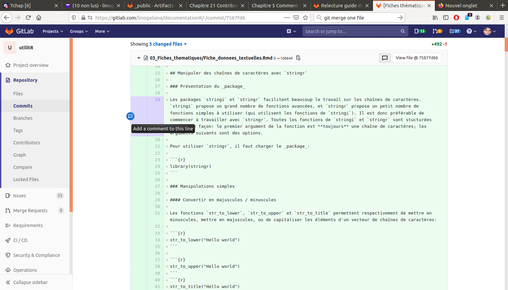
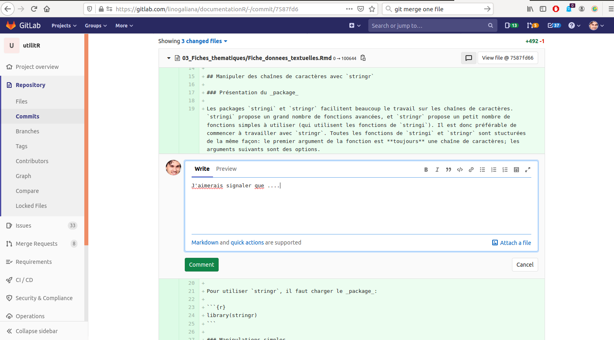
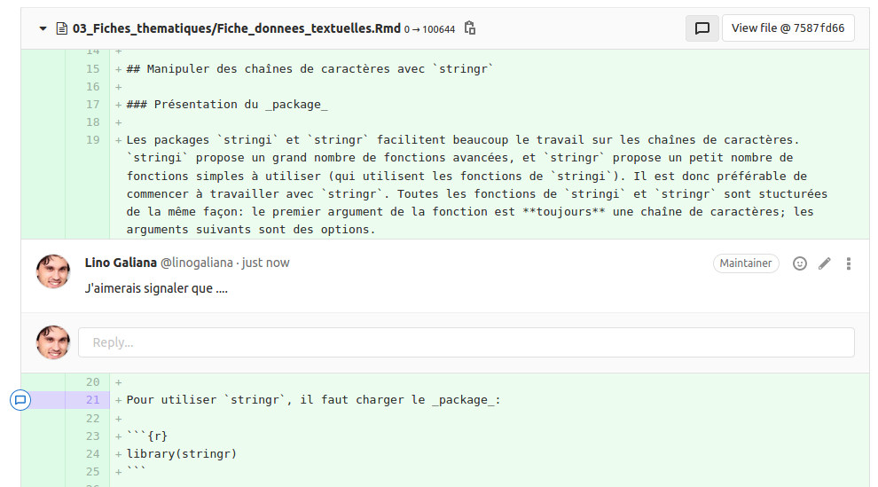

# Guide pour contribuer à la documentation `UtilitR`

## Introduction

Il est possible de contribuer au projet `UtilitR` de différentes manières, détaillées dans ce document. Les contributions peuvent prendre différentes formes, d'un avis argumenté suite à une relecture à des propositions de modification en passant par des propositions d'intégrations de nouveaux éléments dans le livre ou le site. 

**Il n'est pas nécessaire d'être un expert en `R` pour contribuer au projet `UtilitR`.** En revanche, il est nécessaire de s'inscrire dans le fonctionnement
des contributeurs actuels, fonctionnement qui est orchestré autour de `Gitlab` et de ses différents outils.
Il est possible d'en acquérir très rapidement les bases à partir de ce document présentant le [Travail collaboratif avec `R`](https://linogaliana.gitlab.io/collaboratif/git.html#des-bases-de-git), ou à partir d'échanges avec les contributeurs actuels.

Pour les relecteurs quelques notions de l'environnement Gitlab suffisent (ou peuvent s'acquérir facilement) pour apporter sa pierre à l'édifice.

Les mainteneurs et développeurs du projet `UtilitR` sont en effet disponibles pour aider tous les agents qui souhaitent contribuer, ce qui signifie qu'il est possible d'interagir avec eux pour être guidé en cas de difficultés. Toutefois, **le respect des règles de contribution détaillées ci-dessous est essentiel pour l'efficacité du travail collectif et pour assurer la qualité de cette documentation.**

Le document apporte une réponse aux questions suivantes: 

- Comment corriger des coquilles?
- Comment participer aux discussions collectives?
- Comment effectuer la relecture d'une fiche?
    - Comment suggérer des modifications de la fiche via Gitlab?
    - Comment suggérer des remarques sur une fiche via Gitlab?
    - Comment ouvrir une issue si la fiche pose un réel problème?
- Comment ajouter en tant que contributeur une nouvelle fiche? 
    - Comment proposer une nouvelle fiche?
    - Comment élaborer une nouvelle fiche?

## Partie 1: Comment corriger des coquilles?

Pour ce type de modifications légères, il est demandé d'utiliser directement l'outil de suggestions de changements de `Gitlab`. Le dépôt comprend une branche dédiée aux corrections typographiques, orthographiques et grammaticales nommée `typo`. Elle est accessible sur la [page suivante](https://gitlab.com/linogaliana/documentationR/-/merge_requests/52) ou via la page `Merge Requests` accessible sur la gauche. Voici la marche à suivre pour corriger une coquille.

- Se rendre dans l'onglet `Changes`:

    

    Les fiches thématiques apparaissent, en bas de la page (il faut descendre assez bas, ne soyez pas surpris). Il est fréquent que les modifications ne soient pas directement visibles (c'est une des difficultés de l'interface de GitLab), il faut alors cliquer sur le bouton **`Show unchanged lines`**, en dessous du nom de la fiche que vous voulez modifier, pour faire apparaître les modifications:

    

- Naviguer sur la ligne concernée et cliquer sur la bulle sur le commentaire. Cela ouvre un espace de discussion.

    

    C'est dans cette fenêtre que va être faite la suggestion. Il est possible d'accompagner la suggestion d'un commentaire. On procède alors de la manière suivante:

    

    1. Cliquer sur le bouton encadré pour automatiquement générer le bloc de suggestion. Il s'agit d'un bloc `markdown` avec `suggestion:-0+0`.
    2. Modifier le texte dans le bloc pour proposer la suggestion de remplacement. 
    3. Si cela apparaît nécessaire, laisser un commentaire explicatif.

    Il est possible (et vivement recommandé) de prévisualiser la modification en cliquant sur l'onglet `Preview`:

    

- Une fois la suggestion prête, vous pouvez choisir entre:
    * `Start a review`: proposer une série de suggestions dans une unique relecture. Cliquer sur ce bouton permet de réitérer la procédure précédentes sur d'autres paragraphes du fichier, pour proposer d'autres modifications;
    * `Add a comment now`: valider la publication de la suggestion, pour la soumettre aux autres contributeurs.

- Pour mettre fin à une relecture initiée par `Start a review`, ne pas oublier de cliquer sur `Finish review`.

## Partie 2: Comment participer aux discussions collectives?

L'équipe du projet `UtilitR` dispose d'un espace de discussion collective sur les problèmes techniques et les développements futurs du projet. Cet espace de discussion est stocké sur le dépôt Gitlab du projet et est structuré sous forme d'_issues_. Une *issue* est un fil de discussion permettant aux contributeurs du projet (mais aussi aux personnes extérieures) d'échanger sur un sujet précis (défini par le titre de l'*issue*). Vous pouvez consulter la liste des *issues* ouvertes en suivant [ce lien](https://gitlab.com/linogaliana/documentationR/-/issues).

Il est possible de contribuer aux discussions de deux façons:

- en participant à la discussion dans une *issue* existante. Pour participer à la discussion dans un _issue_, il suffit de cliquer sur le titre de l'_issue_, de lire les discussions, et de réagit dans le champ en bas de la page.
- en ouvrant une *issue* sur un nouveau sujet. Pour ouvrir une *issue*, il suffit de [cliquer ici](https://gitlab.com/linogaliana/documentationR/-/issues/new?issue%5Bassignee_id%5D=&issue%5Bmilestone_id%5D=).

Pour des sujets plus transversaux, ou pour demander de l'aide aux autres contributeurs, il est possible de rejoindre le salon de discussion dédié sur le service de messagerie Tchap. Il s'agit d'un salon privé auquel vous pouvez demander l'accès en envoyant un message privé aux mainteneurs du projet (Lino Galiana et Olivier Meslin en ce moment).

## Partie 3: Comment effectuer la relecture d'une fiche?

Un relecteur peut proposer de relire une ou plusieurs fiches de son choix, ou suivre les indications des contributeurs du projet.

**Attention: relire une fiche ne consiste pas à la remanier intégralement.** La relecture doit porter sur les éléments suivants: clarté de l'exposé, cohérence de l'organisation des paragraphes, correction de l'expression, pertinence des conseils, reproductibilité des exemples. Autrement dit, le relecteur a pour rôle de vérifier que la fiche est compréhensible par un utilisateur standard. En revanche, la relecture ne porte pas sur les recommandations formulées dans la fiche, ni sur son organisation globale.

La relecture peut comprendre trois types de tâches:

* Proposer des corrections mineures (faute d'orthographes, formulations peu claires): ce travail de modification est décrit dans __Comment suggérer des modifications de la fiche via Gitlab?__;
* Faire des commentaires (exemple: je ne parviens pas à reproduire cet exemple): ce travail de modification est décrit dans __Comment faire des commentaires sur une fiche via Gitlab?__;
* Des signalements de problèmes: si le relecteur pense que l'organisation d'ensemble ou le déroulement de la fiche soulève une difficulté sérieuse, ou que des points importants n'ont pas été abordés, il est invité à le signaler en suivant la procédure décrite dans la partie __Comment ouvrir une _issue_ si la fiche soulève un problème?__.

### Comment suggérer des modifications de la fiche via Gitlab?

Pour proposer des modifications plus substantielles que des coquilles, erreurs orthographiques et grammaticales, il est possible d'utiliser le bouton `Edit` du site *web*. Cet outil permet de proposer une autre formulation ou d'ajouter une phrase complémentaire pour plus de clareté.  

Le site web correspond à la publication de la documentation au format html. Pour y accèder, il suffit de [cliquer ici](https://linogaliana.gitlab.io/documentationR/index.html).

Dans le menu du document, il faut d'abord se placer dans la fiche à relire et ensuite cliquer sur le bouton `Edit`, en haut à gauche. Un lien s'ouvre automatiquement sur la fiche `.Rmd` et permet d'éditer le contenu depuis `Gitlab`. Cette fonctionnalité est utilisable même lorsque vous n'avez pas les droits en écriture sur le dépôt (droits attachés au statut de *développeur* sur le projet).

Dans ce menu, vous avez accès au code de la fiche en `R markdown` (Write). C'est directement dans cette fenêtre que les modifications sont à écrire. Il est recommandé de prévisualiser la modification en cliquant sur l'onglet `Preview`.

Enfin, une fois la modification écrite, il convient de la valider. Cette opération, nommée `commit` dans la terminologie `git` peut être effectuée en: 

* écrivant un message signifiant dans la fenêtre `Commit message`. Les messages cryptiques du type `modification` sont proscrits. 
* sélectionnant la branche dans laquelle la modification s'applique. Si la modification est à appliquer aux supports déployés, il est nécessaire de sélectionner `master`. Les modifications proposées dans `master` ne sont intégrées qu'après validation des mainteneurs du projets, seuls utilisateurs à avoir les droits en écriture sur la version maître. 

### Comment faire des commentaires sur une fiche via Gitlab?

Les commentaires peuvent être faits directement depuis `Gitlab`. Le [dernier chapitre du livre](https://linogaliana.gitlab.io/-/documentationR/-/jobs/630938451/artifacts/_public/contribuer-aux-supports.html) propose une petite astuce pour se placer dans le dernier état du fichier (en jargon `git`, un *commit*) qui a servi à déployer le livre. 

Il suffit de remplacer les `XXXXX` dans l'url d'exemple <https://gitlab.com/linogaliana/documentationR/-/commit/XXXXX> par le numéro associé au chapitre dans le tableau présent dans le chapitre [dernier chapitre](https://linogaliana.gitlab.io/-/documentationR/-/jobs/630938451/artifacts/_public/contribuer-aux-supports.html). Par exemple, en supposant que l'url est <https://gitlab.com/linogaliana/documentationR/-/commit/7587fd6>, on désire faire un commentaire sur la fiche données textuelles. Si celle-ci est masquée, il faut cliquer sur `Click to expand it`.

Il convient ensuite de naviguer à l'endroit du fichier où on désire faire les modifications. Dans le paragraphe concerné, cliquer sur la bulle de commentaire

Rédiger son commentaire dans la fenêtre qui s'affiche. Il est recommandé de visualiser son commentaire (avec la fenêtre `Preview`) avant de valider le commentaire (bouton `Comment`).

Le commentaire devrait s'afficher sous le paragraphe concerné

### Comment ouvrir une _issue_ si la fiche soulève un problème?

La procédure pour ouvrir une _issue_ est décrite dans la partie 2. L'_issue_ doit avoir un titre qui renvoie explicitement à la fiche concernée (exemple: problème avec la fiche graphiques), et mentionner clairement la nature du problème.

-----------------

## Partie 4: Comment ajouter une nouvelle fiche à la documentation? 

Ajouter une nouvelle fiche thématique à la documentation représente un travail conséquent qui requiert l'approbation de la majorité des contributeurs du projet.

### Comment proposer une nouvelle fiche?

La première étape consiste à __ouvrir une *issue*__ dans le dépôt `Gitlab`. L'_issue_ doit avoir:

- un titre explicite indiquant sur quel sujet vous voulez proposer une fiche (toutes suggestions bienvenues);
- un contenu détaillant l'objet de la fiche et les grandes lignes de son contenu. 

Une fois que l'équipe de contributeurs est d'accord sur l'objet de la fiche et les grandes lignes de son contenu, la fiche peut être rédigée en suivant la procédure décrite ci-dessous.

### Comment élaborer une nouvelle fiche? 

* Créer une branche portant un nom reflétant le contenu de la fiche (exemple: `fiche_graphiques`, `fiche_cartographie`);
* Rédiger la fiche en `Rmarkdown` à partir du modèle de fiche (`03_Fiches_thematiques/Modele_de_fiche.Rmd`); 
    - il est fortement conseillé de lire des fiches existantes pour comprendre la démarche et le niveau de détail retenus par les autres contributeurs;
    - il est impératif de respecter les règles de fond et de forme détaillées ci-dessous;
* Pour chaque branche, un site temporaire est disponible afin de prévisualiser le résultat déployé à chaque fois que les tests automatiques aboutissent, ce que `Gitlab` signale par une croix verte :heavy_check_mark:. La structure de l'url est la suivante: `https://{BRANCH_NAME}--preview-documentationr.netlify.app/` (faire attention aux deux tirets qui se suivent). Par exemple, si la branche en question s'appelle `toto`, l'adresse de prévisualisation est `https://toto--preview-documentationr.netlify.app/`. Le résultat d'une modification met approximativement 5 minutes à être validé (croix verte) dont à être disponible en prévisualisation .
Prévisualiser le résultat sur le site temporaire
* Quand une première version de la fiche est prête:
    - vérifier que le code est bien fonctionnel (c'est-à-dire que la branche compile bien, ce que `Gitlab` indique par une croix verte :heavy_check_mark:);
    - faire un *merge request* vers la branche `master` du dépôt, avec les options `squash commits` et `WIP` (Work In Progress);
* Une discussion s'engage dans la *merge request* sur les améliorations/corrections à apporter à la fiche;
* **La validation d'une fiche est une décision collective**. La règle approximative est qu'une fiche est intégrée à la documentation si quatre ou cinq contributeurs considèrent qu'elle est acceptable en l'état;
* Une fois que la fiche est acceptée, l'un des mainteneurs accepte la *merge request* (ajout de la fiche dans la branche `master`).

### Cahier des charges des fiches de documentation

Toute proposition de fiche doit respecter au maximum les règles suivantes. Si la proposition de fiche ne les respecte pas, les autres contributeurs du projet pourront demander que le contributeur corrige sa proposition.

#### Contraintes formelles

* Rédiger la fiche en `Rmarkdown` à partir du modèle (`03_Fiches_thematiques/Modele_de_fiche.Rmd`);
* Les extensions des images doivent être en minuscules. Cela veut dire qu'il faut éviter l'extension
`.PNG` que `Windows` génère parfois (notamment via l'outil capture). Si un 
ou plusieurs fichiers `.PNG` ont été générés,
vous pouvez utiliser ce [*snippet* de code `R`](https://gitlab.com/linogaliana/documentationR/snippets/1954584) pour le convertir en 
`.png`.

#### Bonnes pratiques de codage en `R`

Dans la mesure où les exemple de code `R` ont vocation à être réutilisés 
directement par les agents de l'Insee, il est demandé aux contributeurs 
de suivre le guide des bonnes pratiques figurant dans la documentation. 
Le principe général est que la documentation doit être reproductible, 
c'est-à-dire avec des exemples exécutables pris isolément. 
Nous attirons particulièrement votre attention sur la gestion des dépendances.

#### Assurer la qualité du code

* **Bien tester tous les exemples**;
* **Pour les exemples, il est recommandé d'utiliser autant que possible les jeux de données figurant dans le _package_ [`doremifasolData`](https://github.com/InseeFrLab/DoReMIFaSolData)**. Plus d'informations dans le paragraphe __Gérer les jeux de données utilisés dans les exemples__;
* Pour présenter l'utilisation d'une fonction:

    + commencer par le comportement par défaut (avec le minimum d'arguments et d'options);
    + présenter les principales options, avec un ou deux exemples;
* Ne pas faire de *merge request* sur un code qui n'est pas entièrement fonctionnel.

#### Gérer et savoir présenter les dépendances

Voici comment on présente l'utilisation d'un `package`:

* Rappeler systématiquement, en début de fiche, que le *package* est chargé avec `library(package)` (plutôt que `package::function()`);
* Rappeler systématiquement que le chargement de tous les *packages* doit se faire **au début** du code, et non au milieu du code;
* **Les *packages* utilisés par une fiche doivent être listés dans le fichier `DESCRIPTION`.** Vous
n'avez pas besoin de le modifier manuellement, vous pouvez utiliser une fonction du
package `usethis` pour cela: `usethis::use_package("monpackage")`. La dépendance sera alors automatiquement ajoutée au fichier `DESCRIPTION`, au niveau de la 
liste des `Imports`. 

#### Gérer les jeux de données utilisés dans les exemples

* Il est recommandé d'utiliser autant que possible les jeux de données figurant dans le _package_ [`doremifasolData`](https://github.com/InseeFrLab/DoReMIFaSolData), qui contient exclusivement des données téléchargées sur le site de l'Insee.
* Il est évidemment possible d'ajouter un nouveau *dataset* à `doremifasolData` si vous pensez qu'aucun des _datasets_ du _package_ ne convient pour vos exemples; pour ce faire il suffit d'ouvrir une _issue_ dans le dépôt Gitlab d'`UtilitR` ou dans le dépôt Github de `doremifasolData`, puis de discuter avec les contributeurs;
* Si vous souhaitez utiliser un jeu de données provenant d'un autre _package_, voici la marche à suivre:
    - demander systématiquement l'approbation des autres contributeurs du projet avant de le faire;
    - préciser systématiquement le *package* d'origine. Par exemple on écrit `data("World", package = "sf")` pour utiliser la table `World` du *package* `sf`. 
* Dans le cas du _package_ [doremifasolData](https://github.com/InseeFrLab/DoReMIFaSolData), on peut simplifier l'appel aux données, par exemple de la manière suivante: `data("filosofi_epci_2016")`.
