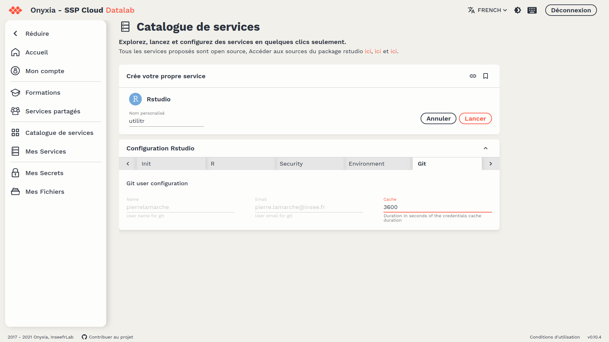
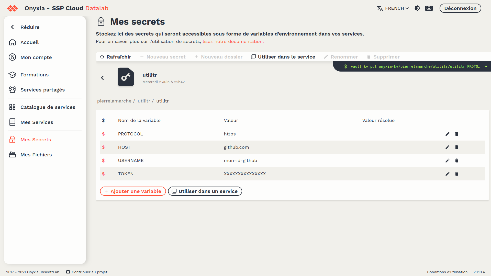

# Guide pour contribuer à la documentation `utilitR`

## :one: Introduction

Il est possible de contribuer au projet `utilitR` de différentes manières, détaillées dans ce document. Les contributions peuvent prendre différentes formes, d'un avis argumenté suite à une relecture à des propositions de modification en passant par des propositions d'intégrations de nouveaux éléments dans le livre ou le site. 

**Il n'est pas nécessaire d'être un expert en `R` pour contribuer au projet `utilitR`.** En revanche, il est nécessaire de s'inscrire dans le fonctionnement
des contributeurs actuels, fonctionnement qui est orchestré autour de `Github` et de ses différents outils.
Il est possible d'en acquérir très rapidement les bases à partir de ce document présentant le [Travail collaboratif avec `R`](https://linogaliana.gitlab.io/collaboratif/git.html#des-bases-de-git), ou à partir d'échanges avec les contributeurs actuels.

Un environnement prêt à l'emploi pour l'exécution des scripts est disponible sur le `SSPCloud`. En cliquant sur le lien suivant, un service `RStudio` avec l'ensemble des dépendances nécessaires pour utiliser la documentation est disponible: [](https://datalab.sspcloud.fr/launcher/inseefrlab-helm-charts-datascience/rstudio?onyxia.friendlyName=%C2%ABrstudio-utilitr%C2%BB&init.personalInit=%C2%ABhttps%3A%2F%2Fraw.githubusercontent.com%2FInseeFrLab%2FutilitR%2Fmaster%2Fresources%2Finit_9juin.sh%C2%BB&service.image.version=%C2%ABinseefrlab%2Futilitr%3A0.8.0%C2%BB)

Pour les relecteurs quelques notions de l'environnement `Github` suffisent
(ou peuvent s'acquérir facilement) pour apporter sa pierre à l'édifice.

Les mainteneurs et développeurs du projet `utilitR` sont en effet disponibles
pour aider tous les personnes qui souhaitent contribuer, ce qui signifie
qu'il est possible d'interagir avec eux pour être guidé en cas de difficultés.
Toutefois, **le respect des règles de contribution détaillées ci-dessous est essentiel pour l'efficacité du travail collectif et pour assurer la qualité de cette documentation.**

Le document apporte une réponse aux questions suivantes: 

- [:arrow_down: Comment proposer des modifications d'une fiche?](#two-comment-proposer-des-modifications-dune-fiche)
- [:arrow_down: Comment participer aux discussions collectives?](#three-comment-participer-aux-discussions-collectives)
- [:arrow_down: Comment effectuer la relecture d'une fiche?](#four-comment-effectuer-la-relecture-dune-fiche)
    - Comment suggérer des remarques sur une fiche via Github?
    - Comment ouvrir une issue si la fiche pose un réel problème?
- [:arrow_down: Comment ajouter en tant que contributeur une nouvelle fiche?](#five-comment-ajouter-une-nouvelle-fiche-à-la-documentation)
    - Comment faire un `fork` du dépôt `utilitR`?
    - Comment mettre à jour son `fork`?
    - Comment proposer sa fiche à la relecture ?
- [:arrow_down: Quelles contraintes formelles doivent respecter les fiches?](#six-contraintes-formelles)

La partie [:arrow_down: Comment ajouter en tant que contributeur une nouvelle fiche?](#five-comment-ajouter-une-nouvelle-fiche-à-la-documentation)
est la plus technique. Elle ne concerne néanmoins qu'un type de contribution
et n'intéressera ainsi pas toutes les modalités de contribution.

Pour effectuer exclusivement une relecture, vous pouvez vous rendre directement
à la section dédiée
([:arrow_down: Comment effectuer la relecture d'une fiche?](#comment-effectuer-la-relecture-dune-fiche))

## :two: Comment proposer des modifications d'une fiche? 

[:arrow_up: Retour à l'introduction](#one-introduction)

Pré-requis: avoir un compte Github.

Pour ce type de modifications, il est demandé d'utiliser directement
l'outil de suggestions de changements de `Github`.
Le livre déployé sur https://www.book.utilitr.org comprend un bouton `Edit` qui
permet de proposer, automatiquement, des modifications via l'interface de 
`Github`. 

Dans le menu du document, il faut d'abord se placer dans la fiche à
relire et ensuite cliquer sur le bouton `Edit`, en haut à gauche :


Un lien s'ouvre automatiquement sur la fiche `.Rmd` et permet d'éditer le
contenu depuis `Github`. Cette fonctionnalité est utilisable même
lorsque vous n'avez pas les droits en écriture sur le dépôt (droits attachés
au statut de *mainteneur* sur le projet), grâce à la notion de [*fork*](https://github.com/InseeFrLab/utilitr-bonnes-pratiques/edit/master/CONTRIBUTING.md#one-forker-le-d%C3%A9p%C3%B4t-utilitr).

A l'ouverture du lien, s'il n'existe pas de fork du projet sur son compte, un pop-up s'ouvre pour indiquer qu'il faut en créer un pour pouvoir proposer des modifications : en acceptant, un fork est créé automatiquement.

On se retrouve alors sur une interface permettant d'éditer,
de visualiser et de proposer des modifications du fichier source. 


La documentation officielle de Github sur cette manière de procéder est
disponible
[ici](https://docs.github.com/en/free-pro-team@latest/github/managing-files-in-a-repository/editing-files-in-another-users-repository).

Dans ce menu, vous avez accès au code de la fiche en `R Markdown`.
C'est directement dans cette fenêtre que les modifications sont à écrire.
Il est recommandé de prévisualiser la modification en cliquant sur l'onglet `Preview`.
En cliquant sur `Preview` vous ne verrez pas la fiche mise en forme mais
les modifications seront identifiées (rouge pour suppression, vert pour
insertion) par le système de contrôle de version `Git`


Enfin, une fois la modification écrite, il convient de la valider.
Cette opération, nommée `commit` dans la terminologie `Git`,
peut être effectuée en: 

* écrivant un message signifiant dans la fenêtre `Commit message`. Les messages cryptiques du type `modification` sont proscrits. 
* sélectionnant la branche dans laquelle la modification s'applique. Si la modification est à appliquer aux supports déployés, il est nécessaire de sélectionner `master`. Les modifications proposées dans `master` ne sont intégrées qu'après validation des mainteneurs du projets, seuls utilisateurs à avoir les droits en écriture sur la version maître. 


:exclamation: **Pour faciliter le suivi et l'intégration des modifications, 
choisir l'option ` Create a new branch for this commit and start a pull request`.
Si la modification ne concerne que des corrections de coquilles,
le nom de la branche doit commencer par `typo-`**. Si les propositions sont plus
substantielles que des coquilles, le nom de la branche est libre. 

Cliquer sur `Propose changes`. Automatiquement, une page pour soumettre cette
modification au dépôt `utilitR` s'ouvre:


Après avoir
éventuellement révisé le titre de la `Pull Request` et la description associée,
cliquer sur `Create pull request`. Cela permettra aux mainteneurs du projet
`utilitR` d'éventuellement intégrer les modifications ou de démarrer une
discussion sur les propositions de modifications. Celles-ci sont visibles
en cliquant sur l'onglet `Files changed`:


## :three: Comment participer aux discussions collectives?

[:arrow_up: Retour à l'introduction](#one-introduction)

L'équipe du projet `utilitR` dispose d'un espace de discussion collective
sur les problèmes techniques et les développements futurs du projet.
Cet espace de discussion est stocké sur le dépôt `Github` du projet et est
structuré sous forme d'_issues_.

Une *issue* est un fil de discussion permettant aux contributeurs du projet (mais aussi aux personnes extérieures) d'échanger sur un sujet précis (défini par le titre de l'*issue*). Vous
pouvez consulter la liste des *issues* ouvertes
en suivant [ce lien](https://github.com/InseeFrLab/utilitR/issues).

Il est possible de contribuer aux discussions de deux façons:

- en participant à la discussion dans une *issue* existante. Pour participer à la discussion dans un _issue_, il suffit de cliquer sur le titre de l'_issue_, de lire les discussions, et de réagit dans le champ en bas de la page.
- en ouvrant une *issue* sur un nouveau sujet. Pour ouvrir une *issue*, il
suffit de [cliquer ici](https://github.com/InseeFrLab/utilitR/issues/new).

Pour des sujets plus transversaux, ou pour demander de l'aide aux autres
contributeurs, il est possible de rejoindre le salon de discussion dédié
sur le service de messagerie `Tchap`. Il s'agit d'un salon privé auquel vous
pouvez demander l'accès en envoyant un message privé aux
mainteneurs du projet (Lino Galiana et Olivier Meslin en ce moment).

## :four: Comment effectuer la relecture d'une fiche?

[:arrow_up: Retour à l'introduction](#one-introduction)

Un relecteur peut proposer de relire une ou plusieurs fiches de son choix,
ou suivre les indications des contributeurs du projet.

**Attention: relire une fiche ne consiste pas à la remanier intégralement.**
La relecture doit porter sur les éléments suivants: clarté de
l'exposé, cohérence de l'organisation des paragraphes, correction de
l'expression, pertinence des conseils, reproductibilité des exemples.
Autrement dit, le relecteur a pour rôle de vérifier que la fiche est
compréhensible par un utilisateur standard. En revanche, la relecture ne porte
pas sur les recommandations formulées dans la fiche, ni sur
son organisation globale.

Il est recommandé de lire la partie
[:arrow_up: Comment proposer des modifications d'une fiche?](#two-comment-proposer-des-modifications-dune-fiche)
avant de proposer des commentaires sur une fiche via Github.

### Où faire des retours sur une fiche ?

Le lieu idéal de retour de la part d'un relecteur ou d'une relectrice dépend du type de modification envisagée :

* Proposer des corrections mineures (faute d'orthographes, formulations peu claires) : ce travail de modification est décrit dans [:arrow_up: Comment proposer des modifications d'une fiche?](#two-comment-proposer-des-modifications-dune-fiche). Les suggestions de modification sont dès lors associées à une `pull request` pour laquelle il convient d'adopter la convention proposée de nommer la branche `typo-XXX`. Lorsque la `pull request` est ouverte, il est possible de renseigner, dans la description de celle-ci, des commentaires génériques. Les commentaires relatifs à une ligne peuvent être faits sous forme de commentaire en cliquant sur l'onglet `Files changed` puis, sur la fiche en question, en ouvrant un commentaire en cliquant sur le signe `+` dans la marge ;
* Faire des commentaires sans suggestion de modifications (exemple: je ne parviens pas à reproduire cet exemple): ce travail de modification est décrit dans __Comment faire des commentaires sur une fiche via Github?__;
* Des signalements de problèmes: si le relecteur pense que l'organisation d'ensemble ou le déroulement de la fiche soulève une difficulté sérieuse, ou que des points importants n'ont pas été abordés, il est invité à le signaler en suivant la procédure décrite dans la partie __Comment ouvrir une _issue_ si la fiche soulève un problème?__.


### Comment faire des commentaires sur une fiche via Github?

La démarche est un peu fastidieuse mais est possible directement depuis `Github`. 
Dans le menu du site web www.book.utilitr.org,
il faut d'abord se placer dans la fiche à
relire et ensuite cliquer sur le bouton `View source`, dans le menu à droite.


Cela ouvre l'état actuel d'une fiche. CLiquer sur le bouton `blame` en haut à droite. 
Sur la marge de gauche sera alors affichée, pour chaque bloc, la
modification (`commit`) ayant amené à l'état actuel du bloc.


Cliquer sur le titre de la modification dans le bloc d'intérêt, par exemple
comme ci-dessus `Quelques reformulations`.

Cela ouvre le `commit` en question. Dans la marge, cliquer sur le bouton qui 
s'affiche (croix bleue):


Rédiger le commentaire et cliquer sur `Add single comment`


### Comment ouvrir une _issue_ si la fiche soulève un problème?

La procédure pour ouvrir une _issue_ est décrite dans la partie
[:arrow_up: Comment participer aux discussions collectives?](#three-comment-participer-aux-discussions-collectives)
L'_issue_ doit avoir un titre qui renvoie explicitement à la fiche concernée (exemple: problème avec la fiche graphiques), et mentionner clairement la nature du problème.


## :five: Comment ajouter une nouvelle fiche à la documentation? 

[:arrow_up: Retour à l'introduction](#one-introduction)


:exclamation: Ajouter une nouvelle fiche thématique à la documentation représente un
travail conséquent qui requiert l'approbation de la
majorité des contributeurs du projet.

### Comment proposer et élaborer une nouvelle fiche?

La première étape consiste à __ouvrir une *issue*__ dans le
dépôt `Github`. L'_issue_ doit avoir:

- un titre explicite indiquant sur quel sujet vous voulez proposer une fiche (toutes suggestions bienvenues);
- un contenu détaillant l'objet de la fiche et les grandes lignes de son contenu. 

Une fois que l'équipe de contributeurs est d'accord sur l'objet de la fiche et les grandes lignes de son contenu, la fiche peut être rédigée en suivant la procédure décrite ci-dessous et les
[contraintes formelles indiquées dans la partie suivante](#six-contraintes-formelles)

:exclamation: Ne pas travailler sur la branche `master` de son fork. Celle-ci
servira à mettre à jour le fork pour intégrer les dernières mises à jour
de la documentation `utilitR`.

### Utiliser un environnement de travail entièrement configuré pour disposer de l'ensemble des librairies nécessaires à la génération de la documentation

Plutôt que d'utiliser un environnement en local dont la configuration peut différer de manière parfois significative avec l'environnement canonique qui sert à générer la documentation `utilitR` sous Github, il est recommandé d'utiliser le service RStudio du SSP Cloud.

#### Lancer le service RStudio configuré

Pour contribuer à `utilitR`, il est possible de créer un service RStudio entièrement paramétré, de la manière suivante :
* dans le catalogue de service, choisir un service RStudio
* sous l'onglet `R`, sélectionner l'image utilitR


Une autre solution consiste à lancer le service directement via [ce lien](https://datalab.sspcloud.fr/launcher/inseefrlab-helm-charts-datascience/rstudio?onyxia.friendlyName=%C2%AButilitr%C2%BB&service.image.version=%C2%ABinseefrlab%2Futilitr%3A0.8.0%C2%BB).

#### Configurer l'accès au dépôt distant Github : la méthode simple et sécurisée

Pour accéder au dépôt distant Github (très généralement un _fork_ du dépôt officiel d'`utilitR`, comme expliqué plus bas), il faut que l'identifiant du compte corresponde à celui configuré dans l'image (dont on peut voir la valeur prise par défaut dans l'onglet Git de la configuration du service, à l'item _user.email_). Dans l'éventualité où cet identifiant ne correspondrait, il est possible de le reconfigurer une fois le service lancé en soumettant dans un terminal la commande suivante :

``` shell
git config --global user.name "Prénom Nom"
git config --global user.email "mon.adresse@mail.com"
```

Il est également possible, pour les utilisateurs avancés, d'incorporer cette commande dans un script d'initialisation qui se lance au démarrage du service, en utilisant également la commande `runuser` de manière à lancer la commande git pour le _user_ `rstudio` et non en _root_ comme cela se fait par défaut.

Enfin, comme montré dans la capture d'écran ci-dessous, il est possible de configurer le mot de passe associé au compte Github de manière à ce qu'il soit conservé dans le cache du service pendant une durée limitée (dans l'exemple ci-dessous, une heure). Une fois le temps écoulé, l'utilisateur devra de nouveau entrer son mot de passe.



#### Configurer l'accès au dépôt distant Github : la méthode à vos risques et périls

La méthode présentée ci-dessus a l'inconvénient qu'elle oblige l'utilisateur à insérer son mot de passe de façon régulière, et quoi qu'il en soit, pour chaque nouveau service RStudio créé sur le SSP Cloud. Il est ainsi possible d'insérer le mot de passe en question dans les variables d'environnement insérées au moment de la création du service, via l'interface `Mes secrets` du SSP Cloud. L'utilisateur intéressé pourra s'il le souhaite consulter la [vidéo de démonstration](https://github.com/InseeFrLab/onyxia-ui/releases/download/assets/Demo_My_Secrets.mp4) explicitant l'usage de ce service.

**ATTENTION : cette méthode comporte des risques car dans l'éventualité où un attaquant parvient à accéder à votre compte sur le SSP Cloud, il récupère des identifiants lui permettant d'accéder, de manière plus ou moins limitée selon la solution retenue, à votre compte Github et à interagir avec vos dépôts. À ce stade, ce n'est pas une méthode recommandée et si elle est utilisée, il convient d'utiliser un jeton d'accès aux droits limités. La fiche `utilitR` [Configurer Git](https://www.book.utilitr.org/git-config.html) présente plus de détails sur la question des jetons d'accès à Github

Ainsi, il est possible de récupérer, de manière systématique, son mot de passe ou, de manière un peu plus sécurisée, le token créé sous Github pour communiquer avec le dépôt. La configuration de l'accès de manière automatique peut se configurer en définissant les secrets ci-dessous dans un dossier `utilitr` :

* `PROTOCOL` : prend la valeur `https`
* `USERNAME` : l'identifiant du compte Github ou Gitlab avec lequel on souhaite interagir sur le dépôt
* `TOKEN` : il s'agit du token mentionné précédemment
* `HOST` : pour un accès à Github, la valeur à insérer est `github.com`
* `FORK` : une variable optionnelle (qui peut donc être omise) qui, dans le cas où elle prend la valeur `TRUE`, permet de clôner le dépôt _fork_ d'`utilitR` de l'utilisateur. Si elle prend toute autre valeur non vide, elle permet de clôner le dépôt `utilitR`, sur lesquel l'utilisateur, s'il n'est pas identifié comme mainteneur, ne pourra pas réaliser de _push_. Dans le cas où la variable n'est pas spécifiée, ou mise à vide, aucun clônage de dépôt n'est réalisé.

de la manière suivante :



On peut ensuite lancer le [service configuré dans ce lien](https://datalab.sspcloud.fr/launcher/inseefrlab-helm-charts-datascience/rstudio?onyxia.friendlyName=%C2%AButilitr-contrib%C2%BB&init.personalInit=%C2%ABhttps%3A%2F%2Fraw.githubusercontent.com%2FInseeFrLab%2FutilitR%2Fmaster%2Finit_utilitr.sh%C2%BB&service.image.version=%C2%ABinseefrlab%2Futilitr%3A0.8.0%C2%BB&vault.secret=%C2%AButilitr%2Futilitr%C2%BB) pour obtenir un service avec une identification persistante.

### :one: Forker le dépôt `utilitR`

Seuls les mainteneurs du dépôt `utilitR` ont les droits d'écriture sur le dépôt
officiel de la documentation. Pour pouvoir proposer de nouvelles fiches, il est
pour un contributeur de passer par un dépôt intermédiaire sur lequel il/elle 
dispose de droits d'écritures.

On appelle ce dépôt un `fork`: c'est une copie
personnelle en ligne d'un dépôt sur lequel on n'a pas les droits en écriture.
Cette version représente une copie à l'instant *t* d'un dépôt, elle n'évolue
pas forcément dans le même sens que le dépôt d'origine (d'où l'image
de la fourchette, qui représente la bifurcation). Néanmoins, si on désire
à un moment soumettre une modification faite sur le fork au dépôt d'origine,
il faudra mettre à jour sa copie personnelle. C'est expliqué dans la 
[partie dédiée](#two-mettre-a-jour-son-fork).


Pour forker le dépôt, il est nécessaire d'avoir un compte `Github`. Une fois
connecté sur ce compte, on fork le dépôt en cliquant à droite de la page:


Pour travailler dessus, il est recommandé de suivre la démarche habituelle
quand on travaille sur un projet associé à `Git`, c'est-à-dire faire une
copie locale du dépôt (`clone`) et de temps en temps, interagir avec le dépôt
distant (votre `fork`). 

### :two: Mettre à jour son fork

Un fork ne suit pas automatiquement les évolutions du dépôt dont il est issu.
La mise à jour doit être faite par le propriétaire du `fork`, c'est-à-dire
vous. 

La [documentation officielle](https://docs.github.com/en/free-pro-team@latest/github/collaborating-with-issues-and-pull-requests/syncing-a-fork) résume les 
manipulations à faire pour garder un `fork` à jour. Nous allons un peu développer
cela.

Généralement, `Github` indique au propriétaire d'un `fork` que sa version
est en retard, ou au contraire en avance, par rapport à la version copiée. 

Pour mettre à jour son `fork`, le plus simple est d'utiliser une copie
locale comme intermédiaire. Supposons que le `fork` a été
cloné afin de disposer d'une copie locale (la Fiche XXXX
expliqué la manipulation `clone` si cela n'a pas été fait).

Ouvrir un terminal Git bash (cf. Fiche XXXX). Taper

```shell
git remote -v
```

pour vérifier l'adresse du dépôt distant prise en compte par `Git`. Le
résultat doit normalement avoir la forme suivant

```shell
# résultat de git remote -v
origin  https://github.com/{GITHUB_USERNAME}/utilitR.git (fetch)
origin  https://github.com/{GITHUB_USERNAME}/utilitR.git (push)
```

L'adresse porte normalement le nom `origin`. `{GITHUB_USERNAME}` est
votre nom d'utilisateur sur `Github`. 

Ajouter l'adresse du dépôt officiel `utilitr` avec le nom `upstream` :

```shell
# résultat de git remote -v
git remote add upstream https://github.com/InseeFrLab/utilitR.git
```

Maintenant, pour vérifier, 

```shell
git remote -v
```

devrait maintenant intégrer une adresse supplémentaire:

```shell
origin  https://github.com/{GITHUB_USERNAME}/utilitR.git (fetch)
origin  https://github.com/{GITHUB_USERNAME}/utilitR.git (push)
upstream        https://github.com/InseeFrLab/utilitR.git (fetch
upstream        https://github.com/InseeFrLab/utilitR.git (push)
```

Le fait d'avoir un dépôt `upstream` et un dépôt `origin` va nous permettre de
mettre à jour ce dernier en utilisant la copie locale comme passe-plat.

En local, se placer sur la branche `master` :

```shell
git checkout master
```

Récupérer les références des dernières modifications du dépôt `utilitR` en
faisant

```shell
git fetch upstream
```

Toutes les conditions sont réunies pour mettre à jour le dépôt local.
Taper

```shell
git merge upstream/master
```

`Git` va tenter l'intégration des dernières modifications de la branche
`master` d'`utilitR` avec la vôtre. Normalement, si la préconisation faite
plus haut de ne pas modifier la branche `master` a été suivie, l'intégration
devrait se faire sans heurt. Sinon, résoudre les conflits à la main et valider.

Une fois que la copie est propre, c'est-à-dire mise à jour, il faut envoyer ces 
modifications à la version en ligne. Pour cela, exécuter la commande suivante

```shell
git push origin master
```

Votre version personnelle (`fork`) a maintenant une branche `master` à jour.


### :three: Rédiger sa fiche dans une branche dédiée

:exclamation: Avant de créer une branche, s'assurer que la branche `master` 
de son `fork` est à jour. Si elle ne l'est pas, la mettre à jour


* Créer une branche portant un nom reflétant le contenu de la fiche (exemple: `fiche_graphiques`, `fiche_cartographie`);
* Rédiger la fiche en `Rmarkdown` à partir du modèle de fiche (`03_Fiches_thematiques/Modele_de_fiche.Rmd`); 
    - il est fortement conseillé de lire des fiches existantes pour comprendre la démarche et le niveau de détail retenus par les autres contributeurs;
    - il est impératif de respecter les règles de fond et de forme détaillées ci-dessous;


:exclamation: La documentation `utilitR` est générée à partir d'un package `R` qu'il est recommandé
d'installer pour prévisualiser le livre dans une session `R` sur son ordinateur.
Le message suivant, qui s'affiche dans la console `R` résume la démarche à suivre pour pouvoir
prévisualiser en local le livre:

> Projet source de la documentation utilitR
> -----------------------------------------
> 
> Pour prévisualiser la version web de l'ouvrage: 
> 
>    * Option 1: utiliser l'onglet 'Build' dans Rstudio;
>    * Option 2: taper dans la commande R:
> ```r
> bookdown::render_book("index.Rmd", output_dir = "_public", output_format = "utilitr::bs4_utilitr")
> ```
> 
> Ne pas oublier d'installer le package 'utilitr' avant pour disposer des modèles de documents: 
> ```r
> remotes::install_github("https://github.com/InseeFrLab/utilitr-template")
> ```

:exclamation: Si vous désirez intégrer une fiche nommée `toto.Rmd`, ne pas oublier de
l'ajouter dans la liste des chapitres du livre en éditant le fichier `_bookdown.yml`

### :four: Proposer sa fiche à la relecture

Quand une première version de la fiche est prête, vous allez pouvoir
faire une *pull request* vers
le dépôt `utilitR`. La cible est la branche `master` du dépôt `utilitR`
(`utilitr/master`) la source est votre branche.

:exclamation: Avant cela, mettez à jour votre branche `master` (comme expliqué
ci-dessus) et intégrez les modifications de `master` dans votre branche. 
Pour cela, une fois faites les manipulations expliquées dans la partie
[:arrow_up: Mettre à jour son fork](two-mettre-a-jour-son-fork). 

En supposant que la branche en question s'appelle `fiche_toto`. Se placer
sur celle-ci:

```shell
git checkout fiche_toto
```

Intégrer les dernières modifications de `master`:

```shell
git merge master
```

S'il y a des conflits les régler. S'il n'y en a pas, la branche est prête
à être proposée au dépôt officiel: la `pull request` peut-être ouverte. 

Vérifier que le code est bien fonctionnel. `Github` indique par une
croix verte :heavy_check_mark: le succès de 
la compilation, c'est-à-dire la compilation de l'ensemble des 
fichiers `R Markdown` en un site HTML et un fichier PDF. 

Si tout va bien, `Github` nous indique le succès


Cliquer, pour dérouler les tests sur `Show all checks`.
En cliquant sur `Details`, on peut accéder au document compilé. 
En bas, on peut télécharger résultat de la
compilation.


Et vérifier, après avoir dézippé et ouvert le fichier `index.html`,
que le résultat mis en forme correspond
à ce qui est désiré. 


Le résultat d'une modification met approximativement 5 minutes à être validé
(croix verte si succès, rouge si échec)
donc à être disponible en prévisualisation .
Prévisualiser le résultat sur le site temporaire

    
* Une discussion s'engage dans la *merge request* sur les améliorations/corrections à apporter à la fiche;
* **La validation d'une fiche est une décision collective**. La règle approximative est qu'une fiche est intégrée à la documentation si quatre ou cinq contributeurs considèrent qu'elle est acceptable en l'état;
* Une fois que la fiche est acceptée, l'un des mainteneurs accepte la *pull request* (ajout de la fiche dans la branche `master`).


## :six: Contraintes formelles

[:arrow_up: Retour à l'introduction](#one-introduction)


Toute proposition de fiche doit respecter au maximum les règles
suivantes. Si la proposition de fiche ne les respecte pas, les
autres contributeurs du projet pourront demander que le
contributeur corrige sa proposition.

### Contraintes générales

* Rédiger la fiche en `Rmarkdown` à partir du modèle (`03_Fiches_thematiques/Modele_de_fiche.Rmd`);
* Les extensions des images doivent être en minuscules. Cela veut dire qu'il faut éviter l'extension
`.PNG` que `Windows` génère parfois (notamment via l'outil capture). Si un 
ou plusieurs fichiers `.PNG` ont été générés,
`Github` vous enverra une informera d'une erreur de la manière suivante:


vous pouvez naviguer dans le fichier `_tools/nouppercase.R`, tout sélectionner
et appuyer sur `CTRL`+ `Entrée` pour exécuter le code. Cela vous donnera la
liste des fichiers incriminés. Avec la fonction 
`convert_extension("PNG")` ces fichiers seront renommés avec la bonne
extension. Ne pas oublier de faire un commit et un push pour envoyer ces
modifications sur `Github`. 

### Bonnes pratiques de codage en `R`

Dans la mesure où les exemple de code `R` ont vocation à être réutilisés 
directement par les agents de l'Insee, il est demandé aux contributeurs 
de suivre le guide des bonnes pratiques figurant dans la documentation. 
Le principe général est que la documentation doit être reproductible, 
c'est-à-dire avec des exemples exécutables pris isolément. 
Nous attirons particulièrement votre attention sur la gestion des dépendances.

### Assurer la qualité du code

* **Bien tester tous les exemples**;
* **Pour les exemples, il est recommandé d'utiliser autant que possible les jeux de données figurant dans le _package_ [`doremifasolData`](https://github.com/InseeFrLab/DoReMIFaSolData)**. Plus d'informations dans le paragraphe __Gérer les jeux de données utilisés dans les exemples__;
* Pour présenter l'utilisation d'une fonction:

    + commencer par le comportement par défaut (avec le minimum d'arguments et d'options);
    + présenter les principales options, avec un ou deux exemples;
* Ne pas faire de *merge request* sur un code qui n'est pas entièrement fonctionnel.

### Gérer et savoir présenter les dépendances

Voici comment on présente l'utilisation d'un `package`:

* Rappeler systématiquement, en début de fiche, que le *package* est chargé avec `library(package)` (plutôt que `package::function()`);
* Rappeler systématiquement que le chargement de tous les *packages* doit se faire **au début** du code, et non au milieu du code;
* **Les *packages* utilisés par une fiche doivent être listés dans le fichier `DESCRIPTION`.** Vous
n'avez pas besoin de le modifier manuellement, vous pouvez utiliser une fonction du
package `usethis` pour cela: `usethis::use_package("monpackage")`. La dépendance sera alors automatiquement ajoutée au fichier `DESCRIPTION`, au niveau de la 
liste des `Imports`. 

### Gérer les jeux de données utilisés dans les exemples

* Il est recommandé d'utiliser autant que possible les jeux de données figurant dans le _package_ [`doremifasolData`](https://github.com/InseeFrLab/DoReMIFaSolData), qui contient exclusivement des données téléchargées sur le site de l'Insee.
* Il est évidemment possible d'ajouter un nouveau *dataset* à `doremifasolData` si vous pensez qu'aucun des _datasets_ du _package_ ne convient pour vos exemples; pour ce faire il suffit d'ouvrir une _issue_ dans le dépôt Gitlab d'`utilitR` ou dans le dépôt Github de `doremifasolData`, puis de discuter avec les contributeurs;
* Si vous souhaitez utiliser un jeu de données provenant d'un autre _package_, voici la marche à suivre:
    - demander systématiquement l'approbation des autres contributeurs du projet avant de le faire;
    - préciser systématiquement le *package* d'origine. Par exemple on écrit `data("World", package = "sf")` pour utiliser la table `World` du *package* `sf`. 
* Dans le cas du _package_ [doremifasolData](https://github.com/InseeFrLab/DoReMIFaSolData), on peut simplifier l'appel aux données, par exemple de la manière suivante: `data("filosofi_epci_2016")`.
