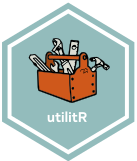

# `utilitR` : une documentation utile pour `R`  <a href='https://www.utilitr.org'></a>

<!-- badges: start -->
[](https://github.com/InseeFrLab/utilitR/actions)
[](https://hub.docker.com/repository/docker/inseefrlab/utilitr/general)
[](https://datalab.sspcloud.fr/launcher/inseefrlab-helm-charts-datascience/rstudio?autoLaunch=true&onyxia.friendlyName=«utilitr-tester»&init.personalInit=«https%253A%252F%252Fraw.githubusercontent.com%252FInseeFrLab%252FutilitR%252Fmaster%252Fresources%252Finit_9juin.sh»&service.image.version=«inseefrlab%2Futilitr%3A0.8.0»)

<!--[](https://mybinder.org/v2/gl/linogaliana%2FdocumentationR/binder?urlpath=rstudio)--->
<!-- badges: end -->

<br>

## :one: Présentation du projet `utilitR`
 
Code source pour le projet `utilitR`, documentation collaborative `R` 
faite par des agents de l'**Insee** et du **Service Statistique Public**.
Elle a vocation à être validée annuellement afin de produire un guide des bonnes pratiques et des fiches techniques.

Elle prend la forme suivante :

* la documentation principale qui est déployée à l'adresse <https://www.book.utilitr.org/> ;
* un guide des bonnes pratiques en `R` déployé à l'adresse <https://www.pratiques.utilitr.org/>

Lorsqu'une version `PDF` sera mise à disposition, un lien direct de téléchargement sera 
disponible. Chaque fiche, disponible sur le site web, peut être imprimée
avec une mise en page agréable grâce à un bouton dédié sur le site web.

Les exemples sont construits sur des données ouvertes, disponibles sur www.insee.fr. 
Le package [`doremifasolData`](https://github.com/InseeFrLab/DoReMIFaSolData) facilite
l'import de ces données dans la documentation. Le modèle de document est
encapsulé dans un *package* `R` dédié: https://github.com/InseeFrLab/utilitr-template 

L'ensemble des ressources du projet `utilitR` sont disponibles sur https://www.utilitr.org

Un environnement prêt à l'emploi est disponible pour les utilisateurs du `SSPCloud` en cliquant
sur le [lien suivant](https://datalab.sspcloud.fr/launcher/inseefrlab-helm-charts-datascience/rstudio?autoLaunch=true&onyxia.friendlyName=«utilitr-tester»&init.personalInit=«https%3A%2F%2Fraw.githubusercontent.com%2FInseeFrLab%2FutilitR%2Fmaster%2Fresources%2Finit_9juin.sh»&service.image.version=«inseefrlab%2Futilitr%3A0.8.0») [](https://datalab.sspcloud.fr/launcher/inseefrlab-helm-charts-datascience/rstudio?autoLaunch=true&onyxia.friendlyName=«utilitr-tester»&init.personalInit=«https%3A%2F%2Fraw.githubusercontent.com%2FInseeFrLab%2FutilitR%2Fmaster%2Fresources%2Finit_9juin.sh»&service.image.version=«inseefrlab%2Futilitr%3A0.8.0»)

<br>

## :two: Objectifs de la documentation :book:

### Public cible

**Cette documentation s'adresse à tous utilisateur de `R` dans le cadre d'un usage courant d'analyse de données.**
Elle est conçue pour aider les utilisateurs à réaliser des traitements statistiques usuels avec `R` et à produire des sorties (graphiques, cartes, documents).

Cette documentation présente succinctement les outils les plus adaptés à ces tâches, et oriente les utilisateurs vers les ressources documentaires pertinentes. En revanche, elle n'aborde pas les outils les plus avancés, notamment ceux utilisés dans un cadre de développement logiciel.

### Structuration de la documentation

La documentation présentée dans www.book.utilitr.org a pour ambition de répondre à deux questions générales:

* Comment réaliser des tâches standards avec `R` (importation et manipulation de données, exploitation d'enquêtes, graphiques...)?
* Comment configurer `R` et `Rstudio` de manière à bénéficier de la richesse de cet écosystème ?

A ces deux sujets s'ajoute une documentation sur les bonnes pratiques de développement avec `R`. 
Ce guide des bonnes pratiques est disponible sur www.pratiques.utilitr.org

### Remarques

Deux points importants sont à noter:

* **Cette documentation recommande les outils et les *packages* les plus adaptés au contexte d'utilisation de `R` à l'Insee**. Dans certains cas, ces recommandations peuvent ne pas être adaptées à d'autres contextes ou être amenées à changer lorsque le contexte interne évoluera. Une grande partie des recommandations sont néanmoins suffisamment générales pour ne pas être spécifiques au contexte Insee. Elles peuvent ainsi servir à de nombreux utilisateurs de données. 
* **Cette documentation recommande d'utiliser `R` avec `Rstudio`**, qui apparaît comme la solution la plus simple et la plus complète pour un usage courant de `R`, et qui est par ailleurs le choix effectué par l'Insee et de nombreuses institutions.

<br>

## :three: Comment contribuer ?

**Le projet `utilitR` est un projet collaboratif, évolutif, *open source* et ouvert à tous, auquel tous les agents peuvent contribuer.**
Le projet est mené par un groupe de contributeurs qui en définissent eux-mêmes le contenu, la structure
et le calendrier. Les objectifs et l'approche collaborative du projet `utilitR` sont détaillés dans [`ce document`](Manifeste.md).

**Toute personne qui le souhaite peut modifier ou compléter la documentation en fonction de ses connaissances et de ses expériences**, et toutes les contributions sont les bienvenues: compléments, corrections d'erreur, améliorations, questions... Il n'y a aucun prérequis, et aucun niveau minimal en `R` n'est demandé. Le dépôt de la documentation est situé [ici](https://github.com/InseeFrLab/utilitR). Toute personne intéressée à contribuer au projet est invitée à consulter le guide des contributeurs (`CONTRIBUTING.md`).

<br>

## :four: Reproductibilité de la documentation

Le projet `utilitR` a pour objectif de favoriser la reproductibilité et
la pérennité des traitements statistiques avec `R`.
Ces principes s'appliquent également à la documentation produite: l'ensemble
des exemples sont construits à partir de données
disponibles sur le site www.insee.fr et les morceaux de code présents
sont faits pour être reproductibles. Pour rendre la documentation plus
reproductible, un certain nombre d'éléments de formattage ont été intégrés
dans un package `R` proposant des modèles de documents standardisés. Il
peut être installé de la manière suivante:

```r
# install.packages("remotes")
remotes::install_github("https://github.com/InseeFrLab/utilitr-template")
```

Les éléments présents dans la documentation visent à être cohérents avec
les recommandations émises par le comité de certification des packages `R` (COPS),
organe interne visant à prescrire ou proscrire certains packages dans le cadre
de la production statistique. 

Plus d'éléments pour faire tourner les codes sont disponibles 
dans ce [document](doc/extra_info.md)
