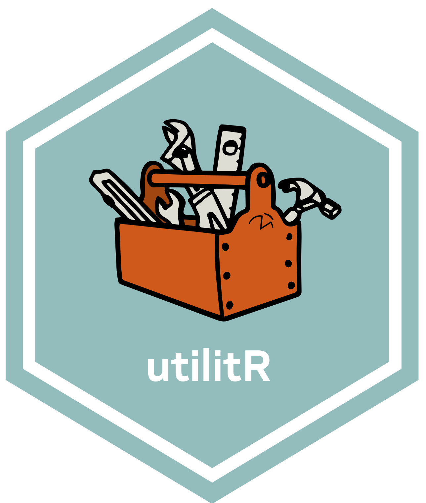

--- 
title: "`UtilitR`: Une documentation utile sur `R`"
subtitle: "Documentation collaborative développée par les agents de l'Insee"
author: "Une documentation collaborative coordonnée par Lino Galiana et Olivier Meslin"
date: "`r Sys.Date()`"
site: bookdown::bookdown_site
documentclass: book
classoption: dvipsnames
subparagraph: true
cover-image: "resources/logo-utilitr.png"
description: "UtilitR: Une documentation utile à R"
# favicon: resources/logo-utilitr.png
toc-title: Table des matières
paged-footnotes: true
lot: false
lof: false
bibliography: [book.bib, packages.bib]
biblio-style: apalike
link-citations: yes
---


# Une documentation collaborative développée à l'Insee {-}

```{=html}
<a href='https://www.utilitr.org'></a>
```

`r colorize("VERSION TEMPORAIRE VOUEE A EVOLUER", "red")`


```{r, include=FALSE}
liste_contrib <- data.table::data.table(
  pseudo = c("Raphaële Adjerad", "Alexis Eidelman",
             "Antoine Dreyer", "Arthur Cazaubiel",
             "Cédric Tassart", "Claire Legroux",
             "Gaëlle Génin", "Gilles Fidani",
             "Lionel Cacheux", "Pascal Mercier",
             "Marie-Emmanuelle Faure", "Mathias André",
             "Olivier Meslin", "Lino Galiana",
             "Pierre Lamarche", "Pierre-Yves Berrard",
             "Romain Lesur", "Sylvain Daubrée",
             "Arlindo Dos-Santos"
  )
)
liste_contrib <- liste_contrib[, c("prenom","nom") := data.table::tstrsplit(
  get('pseudo'), " ", fixed = TRUE
)][order(get("nom"))]
```

*Ont contribué à cette documentation*:
`r paste0(paste(liste_contrib$pseudo, collapse = ", "), ".")`


```{r include=FALSE}
# automatically create a bib database for R packages
knitr::write_bib(c(
  .packages(), 'bookdown', 'knitr', 'rmarkdown'
), 'packages.bib')
```

Le code source de cette documentation est hebergé sous
`Gitlab` et est
[accessible en cliquant sur ce lien](https://gitlab.com/linogaliana/documentationR)

## Objectifs de la documentation `UtilitR` {-}

**Cette documentation s'adresse à tous les agents de l'Insee dans le cadre d'un usage courant de `R`.** Elle est conçue pour aider les agents à réaliser des traitements statistiques usuels avec `R` et à produire des sorties (graphiques, cartes, documents). Cette documentation présente succinctement les outils les plus adaptés à ces tâches, et oriente les agents vers les ressources documentaires pertinentes. En revanche, elle n'aborde pas les outils les plus avancés, notamment ceux utilisés dans un cadre de développement logiciel.

Cette documentation a pour ambition de répondre à trois questions générales:

* Comment travailler avec `R` à l'Insee?
* Comment réaliser des tâches standards avec `R` (importation et manipulation de données, exploitation d'enquêtes, graphiques...)?
* Quelles sont les bonnes pratiques à respecter pour bien utiliser `R`?

Deux points importants sont à noter:

* __Cette documentation recommande les outils et les *packages* les plus adaptés au contexte d'utilisation de `R` à l'Insee__. Ces recommandations ne sont pas nécessairement adaptées à d'autres contextes, et pourront évoluer lorsque ce contexte évoluera.
* __Cette documentation recommande d'utiliser `R` avec `Rstudio`__, qui apparaît comme la solution la plus simple et la plus complète pour un usage courant de `R`.

## Quelle est la place du projet `UtilitR` à l'Insee? {-}

**Le projet `UtilitR` est porté par les agents de l'Insee ou de Système Statistique Publique (SSP) de manière collaborative**.

Le projet `UtilitR` propose en premier lieu une documentation sur le logiciel `R`.
La documentation `UtilitR` s'attache à être cohérente avec les recommandations émises par le comité de certification des _packages_ `R` (COPS).
Dans le futur, d'autres ressources liées à `R`, hébergées sur le site [www.utilitr.org](https://www.utilitr.org) pourront être proposées.


## Comment contribuer à la documentation {-}

**Le projet `UtilitR` est un projet collaboratif, évolutif, *open source* et ouvert à tous, auquel tous les agents peuvent contribuer.** Le projet est mené par un groupe de contributeurs qui en définissent eux-mêmes le contenu, la structure et le calendrier. Les objectifs et l'approche collaborative du projet `UtilitR` sont détaillés dans [ce document](LIEN VERS LE MANIFESTE).

**Tout agent qui le souhaite peut modifier ou compléter la documentation en fonction de ses connaissances et de ses expériences**, et toutes les contributions sont les bienvenues: compléments, corrections d'erreur, améliorations, questions... Il n'y a aucun prérequis, et aucun niveau minimal en `R` n'est demandé. Le dépôt de la documentation est situé [ici](https://gitlab.com/linogaliana/documentationR). Tout agent intéressé à contribuer au projet est invité à consulter le [guide des contributeurs](CONTRIBUTING.md). 
