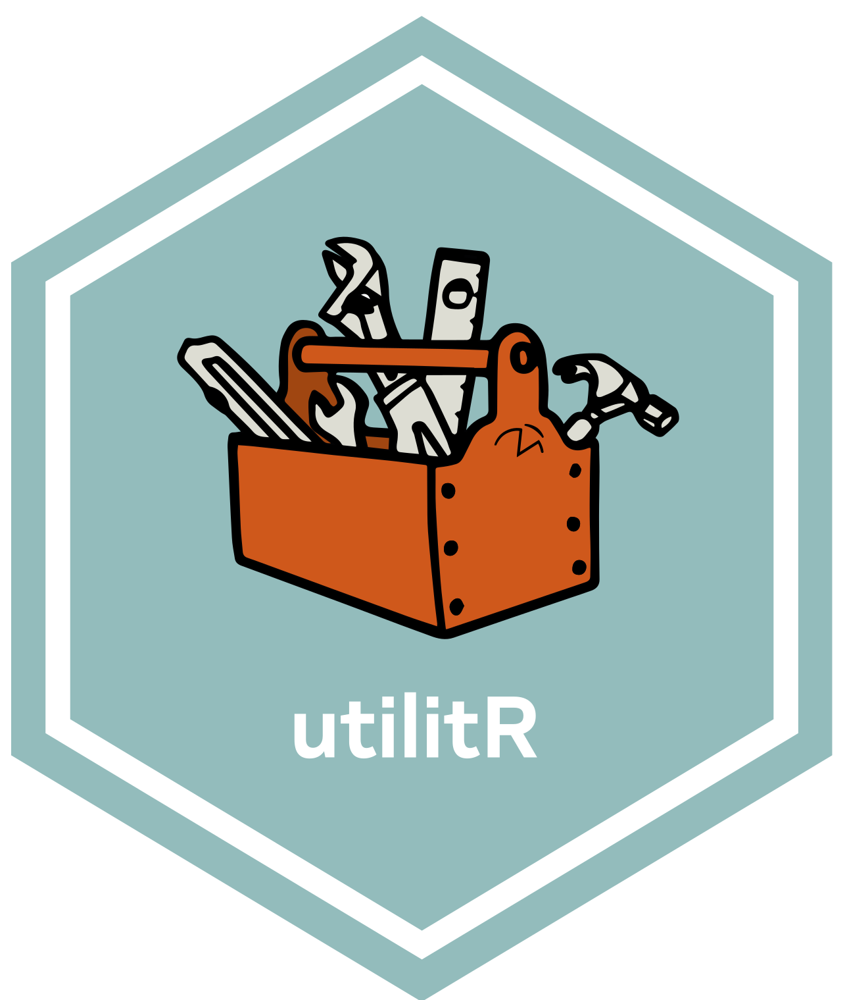

::: {#hero-banner}

:::: {.grid}

::::: {.headline .g-col-lg-9 .g-col-12 .g-col-md-12}

:::::: h1
utilitR
::::::


:::::: h2
Une documentation collaborative sur 
::::::


```{=html}
<a class="github-button" href="https://github.com/inseefrlab/utilitr" data-icon="octicon-star" data-size="large" data-show-count="true" aria-label="Star this website on Github">Star this website on Github</a><script async defer src="https://buttons.github.io/buttons.js"></script>
```

<br>

Le projet `utilitR` est une __documentation collaborative__ sur l'usage du
logiciel , née à l'__Insee__,
destinée à tout utilisateur intéressé par la manipulation
de données __sans pré-requis de niveau__.

Le contenu d'`utilitR` est entièrement disponible en _open source_ sur `Github` .

<br>

::: {.callout-tip}
## [`utilitR` ne couvre pas tous les besoin, loin s'en faut!]{.bigger120}

:::: {.bigger120}

Vous voulez de l'aide pour convertir des codes SAS en `R`? Vous voulez vous former aux bonnes pratiques de développement? Vous voulez faire de la cartographie avancée avec `R`?

Si c'est le cas, `utilitR` ne vous aidera pas beaucoup, mais des liens vers des ressources utiles vous attendent en bas de cette page, n'hésitez pas à les consulter!

::::
:::


:::::

::::: {.g-col-lg-3 .g-col-12 .g-col-md-12}

:::::

::::

:::


## Ressources utiles {.unnumbered}

### Convertir des codes SAS en `R` {.unnumbered}

La Dares a constuit un [aide-mémoire de SAS vers `R`](https://aide-memoire-r-sas.netlify.app/01-aide_memoire_r_sas) pour aider les agents qui doivent convertir des chaînes SAS vers `R` et Python.

Cet aide-mémoire propose une traduction des codes standards d'une analyse statistique en SAS, `R` (environnements `R` base, `tidyverse`, `data.table`, `arrow/duckdb`) et `pandas` en Python. Ambitieux, il vise à décloisonner les différents langages, en facilitant le passage et l'intercompréhension entre eux.

Le lecteur y trouvera un utile complément d'`utilitR`: il met plus l'accent sur le code informatique que sur les explications théoriques, mais s'appuie sur les conseils d'`utilitR` et s'y réfère si nécessaire.

N'hésitez pas à le consulter, vous pourriez y trouver des réponses à vos questions ! 


<!-- ### Se former aux bonnes pratiques de développement {.unnumbered} -->

<!-- Lien vers la formation BP. -->

<!-- ### Faire de la cartographie avec `R` {.unnumbered} -->

<!-- Quelles ressources? -->

